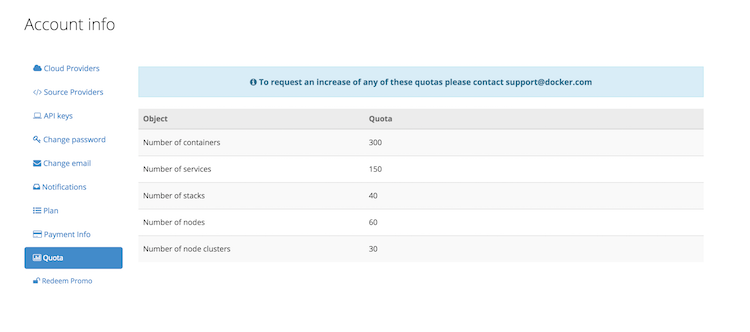

TESTING TESTING TESTING AND MORE TESTING!!!

## Question

Can the maximum number of containers per service, number of services per stack, or number of nodes per node cluster on Docker Cloud be increased?

## Answer

Currently we can't increase the max number of containers per service, max number of services per stack, or max number of nodes per node cluster quota beyond the default values.

You can however request a quota increase on the following objects below: [https://cloud.docker.com/account/#quota](https://cloud.docker.com/account/#quota "https://cloud.docker.com/account/#quota").

To request a quota increase please [open a support ticket](https://support.docker.com).
