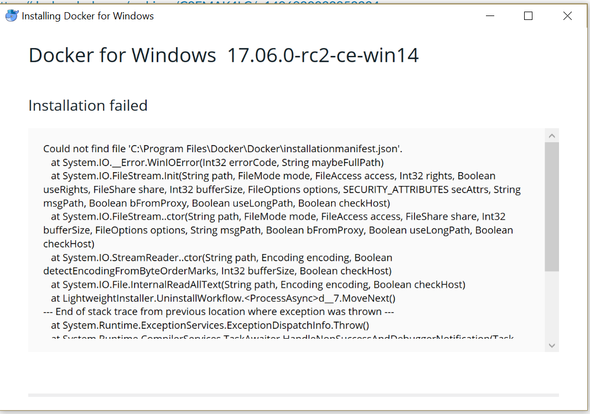

## Issue

Installation failed: Could not find file `C:\Program Files\Docker\Docker\installationmanifest.json`.

Tried to upgrade Docker for Windows to version 17.06.O-rc2-ce-win14 and the installed failed.

This happened when trying to upgrade, as well as after uninstalling the previous version through the windows GUI.


```
    Text from error:
    Installing Docker for Windows 
    Docker for Windows 
    Installation failed 
    x 
    17.06.O-rc2-ce-win14 
    Could not find file 'C:\Program Files\Docker\Docker\installationmanifest.json'. 
    at System.lO._Error.WinlOError(lnt32 errorCode, String maybeFullPath) 
    at System.lO.FileStream.lnit(String path, FileMode mode, FileAccess access, Int32 rights, Boolean 
    useRights, FileShare share, Int32 bufferSize, FileOptions options, SECURITY_ATTRIBUTES secAttrs, String 
    msgPath, Boolean bFromProxy, Boolean useLongPath, Boolean checkHost) 
    at System.lO.FileStream..ctor(String path, FileMode mode, FileAccess access, FileShare share, Int32 
    bufferSize, FileOptions options, String msgPath, Boolean bFromProxy, Boolean useLongPath, Boolean 
    checkHost) 
    at System.lO.StreamReader..ctor(String path, Encoding encoding, Boolean 
    detectEncodingFromByteOrderMarks, Int32 bufferSize, Boolean checkHost) 
    at System.lO.File.lnternalReadAllText(String path, Encoding encoding, Boolean checkHost) 
    at Lightweightlnstaller.UninstallWorkflow.<ProcessAsync>d_7.MoveNext() 
    End of stack trace from previous location where exception was thrown 
    at System. Runtime. ExceptionServices. Exception Dispatchl nfo. Throw()
```
## Prerequisites

* 64bit Windows 10 Pro, Enterprise and Education (1511 November update, Build 10586 or later)

## Resolution

There is a leftover registry key from an old uninstall pointing to a folder that for whatever reason no longer exists. It needs to be removed before the installer can proceed.

1. Kill the installer process if it's still running.
2. Run Regedit.
3. Run a quick backup of the registry by selecting **File** > **Export** (It is recommended that you set the export range to **All**.)
4. Navigate to `Computer\HKEY_LOCAL_MACHINE\SOFTWARE\Microsoft\Windows\CurrentVersion\Uninstall`
5. If there is a `Docker for Windows` entry, delete key and all subkeys.
6. Relaunch the installer, and you should no longer be prompted to update. The installer should proceed as a fresh install from this point.
