## Introduction
Docker lives by “Secure by Default.” With Docker Enterprise Edition (Docker EE), the default configuration and policies provide a solid foundation for a secure environment. However, they can easily be changed to meet the specific needs of any organization.

Docker focuses on three key areas of container security: *secure access*, *secure content*, and *secure platform*. This results in having isolation and containment features not only built into Docker EE but also enabled out of the box. The attack surface area of the Linux kernel is reduced, the containment capabilities of the Docker daemon are improved, and admins build, ship, and run safer applications.

<a name="what-you-will-learn"></a>
## What You Will Learn
This document outlines the default security of Docker EE as well as best practices for further securing Universal Control Plane and Docker Trusted Registry. New features introduced in Docker EE 17.06 such as image promotion and immutability with Docker Content Trust and the new RBAC models are also explored.

<a name="prerequisites"></a>
## Prerequisites

* Docker EE 17.06 and higher on a Linux host OS with kernel 3.10 or greater.
* Become familiar with [Docker Concepts from the Docker docs](https://docs.docker.com/engine/understanding-docker/).

<a name="abbreviations"></a>
## Abbreviations
The following abbreviations are used in this document:

* DDC = Docker Datacenter (UCP and DTR)
* UCP = Universal Control Plane
* DTR = Docker Trusted Registry
* DCT = Docker Content Trust
* RBAC = Role Based Access Control
* CA = Certificate Authority
* EE = Docker Enterprise Edition
* CE = Docker Community Edition
* HA = High Availability
* BOM = Bill of Materials
* CLI = Command Line Interface
* CI = Continuos Integration

<a name="node"></a>
## Engine and Node Security
There are already several resources that cover the basics of Docker Engine security.

* [Docker Security Documentation](https://docs.docker.com/engine/security/security/) covers the fundamentals, such as namespaces and control groups, the attack surface of the Docker daemon, and other kernel security features.
* [CIS Docker Community Edition Benchmark v1.1.0](CIS_Docker_Community_Edition_Benchmark_v1.1.0.pdf) covers the various security-related options in Docker Engine. Useful with Docker EE.
* [Docker Bench Security](https://github.com/docker/docker-bench-security) is a script that audits your configuration of Docker Engine against the CIS Benchmark.

<a name="choice-os"></a>
### Choice of Operating Systems
Docker EE Engine 17.06 (which is a required prerequisite for installing UCP and included with Docker EE) is supported on the following host operating systems:

* RHEL/CentOS/Oracle Linux 7.1/7.2/7.3/7.4 (YUM-based systems)
* Ubuntu 14.04 LTS, 16.04 LTS
* SUSE Linux Enterprise 12

For other versions, check out the [official Docker support matrix](https://success.docker.com/Policies/Compatibility_Matrix).

To take advantage of the built-in security configurations and policies, run the latest version of Docker EE Engine. Also ensure that you update the OS with all of the latest patches. In all cases it is highly recommended to remove as much unnecessary software as possible.

<a name="limit-access-to-node"></a>
### Limit Root Access to Node
Docker EE uses a completely separate authentication backend from the host, providing a clear separation of duties. Docker EE can leverage an existing LDAP/AD infrastructure for authentication. It even utilizes [RBAC Labels](#ucp-rbac) to control access to objects like images and running containers, meaning teams of users can be given full access to running containers. With this access, the users can watch the logs and execute a shell inside the running container. The user never needs to log into the host. Limiting the number of users that have access to the host reduces the attack surface.

<a name="remote-access-daemon"></a>
### Remote Access to Daemon
Don't enable the remote daemon socket. If you must open it for Engine, then ALWAYS secure it with certs. When using Universal Control Plane, you should not open the daemon socket. If you must, be sure to review the [instructions for securing the daemon socket](https://docs.docker.com/engine/security/https/).

<a name="privileged-containers"></a>
### Privileged Containers
Avoid running privileged containers if at all possible. Running a container privileged gives the container access to ALL the host namespaces (i.e. net, pid, and others). This gives full control of the host to the container. Keep your infrastructure secure by keeping the container and host authentication separate.

<a name="container-uid"></a>
### Container UID Management
By default the user inside the container is root. Using a defense in depth model, it is recommended that not all containers run as root. An easy way to mitigate this is to use the `--user` declaration at run time. The container runs as the specified user, essentially removing root access.

Also keep in mind that the UID/GID combination for a file inside a container is the same outside of the container. In the following example, a container is running with a UID of 10000 and GID of 10000. If the user touches a file such as `/tmp/secret_file`, on a BIND-mounted directory, the UID/GID of the file is the same both inside and outside of the container as shown:

```
root @ ~  docker run --rm -it -v /tmp:/tmp --user 10000:10000 alpine sh
/ $ whoami
whoami: unknown uid 10000
/ $ touch /tmp/secret_file
/ $ ls -asl /tmp/secret_file
     0 -rw-r--r--    1 10000    10000            0 Jan 26 13:48 /tmp/secret_file
/ $ exit
root @ ~  ls -asl /tmp/secret_file
0 -rw-r--r-- 1 10000 10000 0 Jan 26 08:48 /tmp/secret_file
```

Developers should `root` as little as possible inside the container. Developers should create their app containers with the `USER` declaration in their Dockerfiles.

<a name="seccomp"></a>
### Seccomp

> **Note:** Seccomp for Docker EE Engine is available starting with RHEL/CentOS 7 and SLES 12.

Seccomp (short for **Secure Computing Mode**) is a security feature of the Linux kernel, used to restrict the syscalls available to a given process.  This facility has been in the kernel in various forms since 2.6.12 and has been available in Docker Engine since 1.10.  The current implementation in Docker Engine provides a default set of restricted syscalls and also allows syscalls to be filtered via either a whitelist or a blacklist on a per-container basis (i.e. different filters can be applied to different containers running in the same Engine).  Seccomp profiles are applied at container creation time and cannot be altered for running containers.

Out of the box, Docker comes with a default Seccomp profile that works extremely well for the vast majority of use cases.  In general, applying custom profiles is not recommended unless absolutely necessary.  More information about building custom profiles and applying them can be found in the [Docker Seccomp docs](https://docs.docker.com/engine/security/seccomp/).

To check if your kernel supports seccomp:

```
cat /boot/config-`uname -r` | grep CONFIG_SECCOMP=
```

Look for the following in the output:

```
CONFIG_SECCOMP=y
```

<a name="apparmor-selinux"></a>
### AppArmor / SELinux

AppArmor and SELinux are similar to Seccomp in regards to use profiles. They differ in their execution though. The profile languages used by AppArmor and SELinux are different. AppArmor is only on Debian-based distributions such as Debian and Ubuntu. SELinux is available on Fedora/RHEL/CentOS/Oracle Linux. Rather than a simple list of system calls and arguments, both allow for defining actors (generally processes), actions (reading files, network operations), and targets (files, IPs, protocols, etc.). Both are Linux kernel security modules, and both support mandatory access controls (MAC).

They need to be enabled on the host, while SELinux can be enabled at the daemon level.

To enable SELinux in the Docker daemon modify `/etc/docker/daemon.json` and add the following:

```
"selinux-enabled": true
```

> **Note** Remember that the file `daemon.json` is JSON-based and needs opening and closing braces — `{ }`.

To check if SELinux is enabled:

```
docker info |grep -A 3 "Security Options"
```

`selinux` should be in the output if it is enabled:

```
Security Options:
 seccomp
  Profile: default
 selinux
```

AppArmor is not applied to the Docker daemon. Apparmor profiles need to be applied at container run time:

```
docker run --rm -it --security-opt apparmor=docker-default hello-world
```

There are some good resources for installing and setting up AppArmor/SELinux such as:

* [Techmint - Implementing Mandatory Access Control with SELinux or AppArmor in Linux](http://www.tecmint.com/mandatory-access-control-with-selinux-or-apparmor-linux/)
* [nixCraft - Linux Kernel Security (SELinux vs AppArmor vs Grsecurity)](https://www.cyberciti.biz/tips/selinux-vs-apparmor-vs-grsecurity.html)

Bottom line is that you should always use AppArmor or SELinux for their supported operating systems.

<a name="capabilities"></a>
### Runtime Privilege and Linux Capabilities — Advanced Tooling

> *Starting with kernel 2.2, Linux divides the privileges traditionally associated with superuser into distinct units, known as capabilities, which can be independently enabled and disabled.*  — [Capabilities man page](http://man7.org/linux/man-pages/man7/capabilities.7.html)

Linux capabilities are an even more granular way of reducing surface area. Docker Engine has a default list of capabilities that are kept for newly-created containers, and by using the `--cap-drop` option for `docker run`, users can exclude additional capabilities from being used by processes inside the container on a capability-by-capability basis. All privileges can be dropped with the `--user` option.

Likewise, capabilities that are, by default, not granted to new containers can be added with the `--cap-add` option, though this is discouraged unless absolutely necessary.  Using `--cap-add=ALL` is highly discouraged.

More details can be found in the [Docker Run Reference](https://docs.docker.com/engine/reference/run/#/runtime-privilege-and-linux-capabilities).

<a name="cis-controls"></a>
### Controls from the CIS Benchmark
There are many good practices that should be applied from the [CIS Docker Community Edition Benchmark v1.1.0](CIS_Docker_Community_Edition_Benchmark_v1.1.0.pdf ). Some of the controls may not be applicable to your environment. To apply these controls, edit the Engine settings. Editing the Engine setting in `/etc/docker/daemon.json` is the best choice for most of these controls. Refer to the [daemon.json guide](https://docs.docker.com/engine/reference/commandline/dockerd/#/daemon-configuration-file) for details.

<a name="logging"></a>
#### Apply Centralized Logging — CIS CE Benchmark v1.1.0 : Section 2.12
Having a central location for all Engine and container logs is recommended. This provides "off-node" access to all the logs, empowering developers without having to grant them SSH access.

To enable centralized logging, modify `/etc/docker/daemon.json` and add the following:

```
"log-level": "syslog",
"log-opts": {syslog-address=tcp://192.x.x.x},
```

Then restart the daemon:

```
sudo systemctl restart docker
```

<a name="disablereg"></a>
#### Disable Legacy Registries — CIS CE Benchmark v1.1.0 : Section 2.13
With Docker registry v2, there are some new security features. More specifically, v2 disables the use of HTTP requests in favor of HTTPS. This is why it is advised to disable legacy support.

To disable support for legacy registries, modify `/etc/docker/daemon.json` and add the following:

```
"disable-legacy-registry": true,
```

Then restart the daemon:

```
sudo systemctl restart docker
```

<a name="dct"></a>
#### Enable Content Trust — CIS CE Benchmark v1.1.0 : Section 4.5
Content Trust is the cryptographic guarantee that the image pulled is the correct image. Content Trust is enabled by Notary. [Signing images with Notary is discussed](#dtr-notary) later in this document.

When transferring data among networked systems, trust is a central concern. In particular, when communicating over an untrusted medium such as the Internet, it is critical to ensure the integrity and the publisher of all the data a system operates on. Docker engine is used to push and pull images (data) to a public or private registry. Content Trust provides the ability to verify both the integrity and the publisher of all the data received from a registry over any channel. Content Trust is available on Docker Hub or DTR 2.1.0 and higher. To enable it, add the following shell variable:

```
export DOCKER_CONTENT_TRUST=1
```

<a name="docker-bench"></a>
### Audit with Docker Bench
[Docker Bench Security](https://store.docker.com/community/./images/docker/docker-bench-security) is a script that checks for dozens of common best practices around deploying Docker containers in production. The tests are all automated and are inspired by the [CIS Docker Community Edition Benchmark v1.1.0](CIS_Docker_Community_Edition_Benchmark_v1.1.0.pdf ).

Here is how to run it :

```
docker run -it --net host --pid host --cap-add audit_control \
    -e DOCKER_CONTENT_TRUST=$DOCKER_CONTENT_TRUST \
    -v /var/lib:/var/lib \
    -v /var/run/docker.sock:/var/run/docker.sock \
    -v /usr/lib/systemd:/usr/lib/systemd \
    -v /etc:/etc --label docker_bench_security \
    docker/docker-bench-security
```
Here is example output:

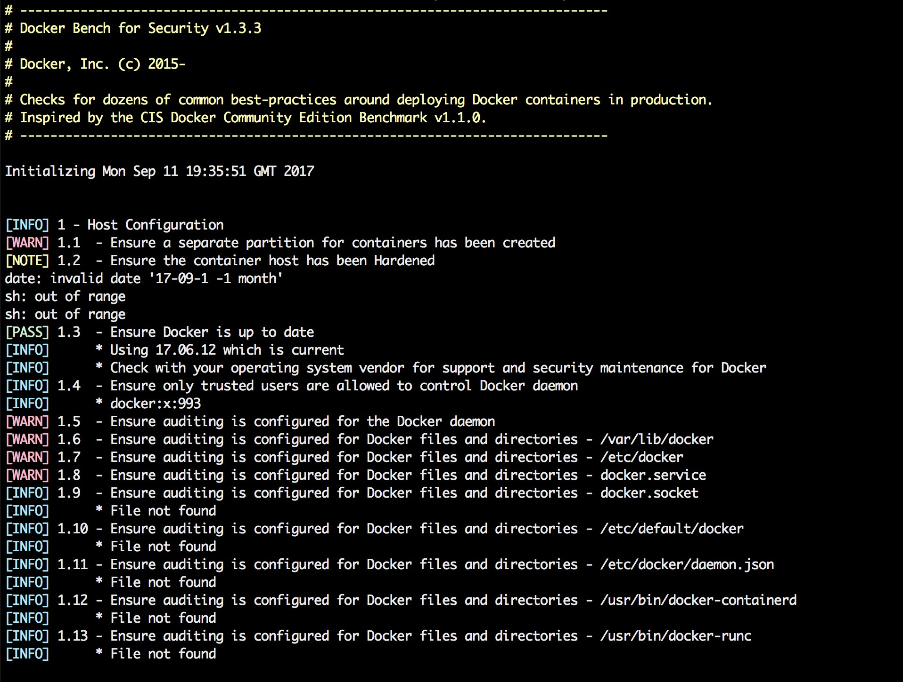

The output is straightforward. There is a status message, CIS Benchmark Control number, and description fields. Look for the `[WARN]` messages. The biggest section to pay attention to is `1 - Host Configuration`. Keep in mind that this tool is designed to audit Docker Engine and is a good starting point. Docker Bench Security is NOT intended for auditing the setup of UCP/DTR. There are a few controls that, when enabled, break UCP and DTR.

The following controls are not needed because they affect the operation of UCP/DTR:

* 2.1 Restrict network traffic between containers — Needed for container communication
* 2.6 Configure TLS authentication for Docker daemon — Should not be enabled as it is not needed
* 2.8 Enable user namespace support — Currently not supported with UCP/DTR
* 2.15 Do not enable Swarm mode, if not needed — Swarm mode is the underlying orchestration framework
* 2.18 Disable Userland Proxy — Disabling the proxy affects how the routing mesh works

<a name="winnode"></a>
## Windows Engine and Node Security
As 17.06, Docker EE includes native Windows Server 2016 support. This means you can install Docker EE on Windows natively and attach it to a UCP Swarm. Currently, only Windows worker nodes are supposed. There are some really nice advantages to this. Linux and Windows workloads can now be managed from the same orchestration framework. Windows actually has an added advantage. Windows Server 2016 can encapsulate Docker containers with a Hyper-V virtual machine. This means the Windows workers can actually run the Linux workloads independently.

Some of the advantages of Windows worker nodes include:

* Eliminates conflicts between different versions of IIS/.NET to coexist on a single system with container isolation
* Works with Hyper-V virtualization
* Takes advantage of new base images like Windows Server Core and Nano Server
* Provides a consistent Docker user experience — use the same commands as Docker for Linux environments
* Adds isolation properties with Hyper V containers selected at runtime

Using the Hyper-V isolation provides another layer of security.

For more information about installing Docker EE on Windows Server 2016 follow the [documentation](https://docs.docker.com/engine/installation/windows/docker-ee/). To learn more about Docker on Windows 2016 read the [Docker for Windows Server features](https://www.docker.com/docker-windows-server).

<a name="ucp"></a>
## UCP Security
Universal Control Plane is configured to be "Secure by default." It uses two Certificate Authorities with Mutual TLS. UCP sets up two CAs. One CA is used for ALL internal communication between managers and workers. The second CA is for the end user communication. Two communication paths are vital to keeping the traffic segregated. The use of Mutual TLS is automatic between the manager and worker nodes. Mutual TLS is where both the client and the server verify the identity of each other. Another important note is that the worker nodes are unprivileged, meaning they do not have access to the cluster state or secrets. When adding nodes to the UCP cluster, a join token must be used. The token itself incorporates the checksum of the CA cert so the new node can verify that it is communicating with the right swarm.


<a name="ucp-network"></a>
### Networking
Networking can be an important part of a Docker EE deployment. The basic rule of thumb is not to have firewalls between the manager and worker nodes. When deploying to a cloud infrastructure, low latency is a must between nodes. Low latency ensures the databases are able to keep quorum. When a software, or hardware, firewall is deployed between the nodes, the following ports need to be opened.

| Hosts             | Direction | Port                    | Purpose                                                                           |
|-------------------|-----------|-------------------------|-----------------------------------------------------------------------------------|
| managers, workers | in        | TCP 443 (configurable)  | Port for the UCP web UI and API                                                   |
| managers          | in        | TCP 2376 (configurable) | Port for the Docker Swarm manager. Used for backwards compatibility.              |
| managers, workers | in        | TCP 2377 (configurable) | Port for communication between swarm nodes                                        |
| managers, workers | in, out   | TCP, UDP 4789           | Port for overlay networking                                                       |
| managers, workers | in, out   | TCP, UDP 7946           | Port for overlay networking                                                       |
| managers, workers | in        | TCP 12376               | Port for a TLS proxy that provides access to UCP, Docker Engine, and Docker Swarm |
| managers          | in        | TCP 12379               | Port for internal node configuration, cluster configuration, and HA               |
| managers          | in        | TCP 12380               | Port for internal node configuration, cluster configuration, and HA               |
| managers          | in        | TCP 12381               | Port for the certificate authority                                                |
| managers          | in        | TCP 12382               | Port for the UCP certificate authority                                            |
| managers          | in        | TCP 12383               | Port for the authentication storage backend                                       |
| managers          | in        | TCP 12384               | Port for the authentication storage backend for replication across managers       |
| managers          | in        | TCP 12385               | Port for the authentication service API                                           |
| managers          | in        | TCP 12386               | Port for the authentication worker                                                |

<a name="ucp-auth"></a>
### Authentication
Docker EE features a single sign-on for the entire cluster, which is accomplished via shared authentication service for UCP and DTR. The single sign-on is provided out of the box with AuthN or via an externally-managed LDAP/AD authentication service. Both authentication backends provide the same level of control. When available, a corporate LDAP service can provide a smoother account experience for users. Refer to the [LDAP/AD configuration docs](https://docs.docker.com/datacenter/ucp/2.2/guides/admin/configure/external-auth/) and [Docker EE Best Practices and Design Considerations](https://success.docker.com/Architecture/Docker_Reference_Architecture%3A_Docker_EE_Best_Practices_and_Design_Considerations) for instructions and best practices while configuring LDAP authentication.

To change the authentication to LDAP, go to **Admin --> Admin Settings --> Certificates** in the UCP web interface.
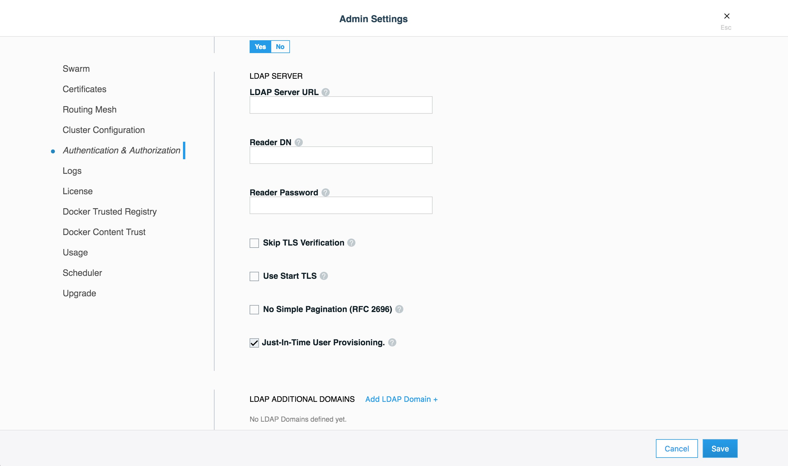

<a name="ucp-cert"></a>
### External Certificates
Using external certificates is a good option when integrating with a corporate environment. Using external, officially-signed certificates simplifies having to distribute Certificate Authority certificates. One best practice is to use the Certificate Authority (CA) for your organization. Reduce the number of certificates by adding multiple Subject Alternative Names (SANs) to a single certificate. This allows the certificate to be valid for multiple URLs. For example, you can set up a certificate for `ucp.example.com`, `dtr.example.com`, and all the underlying hostnames and IP addresses. One certificate/key pair makes deploying certs easier.

To add an external certificate, go to **Admin --> Admin Settings --> Certificates** in the UCP web interface and add the CA, Cert, and Key.

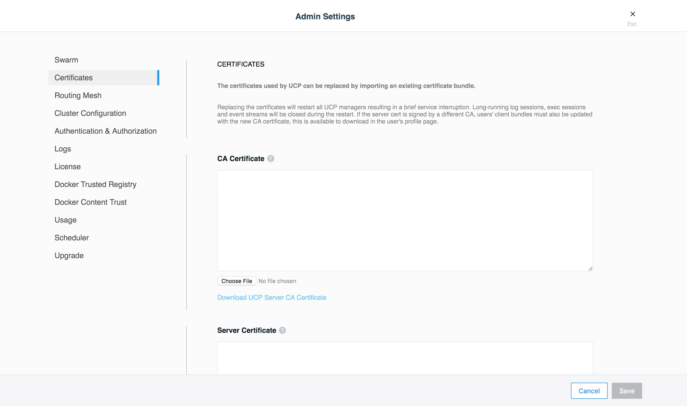

More detailed [instructions for adding external certificates](https://docs.docker.com/datacenter/ucp/2.2/guides/admin/configure/use-your-own-tls-certificates/) are available in the Docker docs.

<a name="token-rotate"></a>
### Join Token Rotation
Depending on how the swarm cluster is built, it is possible to have the join token stored in an insecure location. To alleviate any concerns, join tokens can be rotated once the cluster is built. To rotate the keys, go to the **Admin --> Admin Settings --> Swarm** page, and click the **Rotate** button.

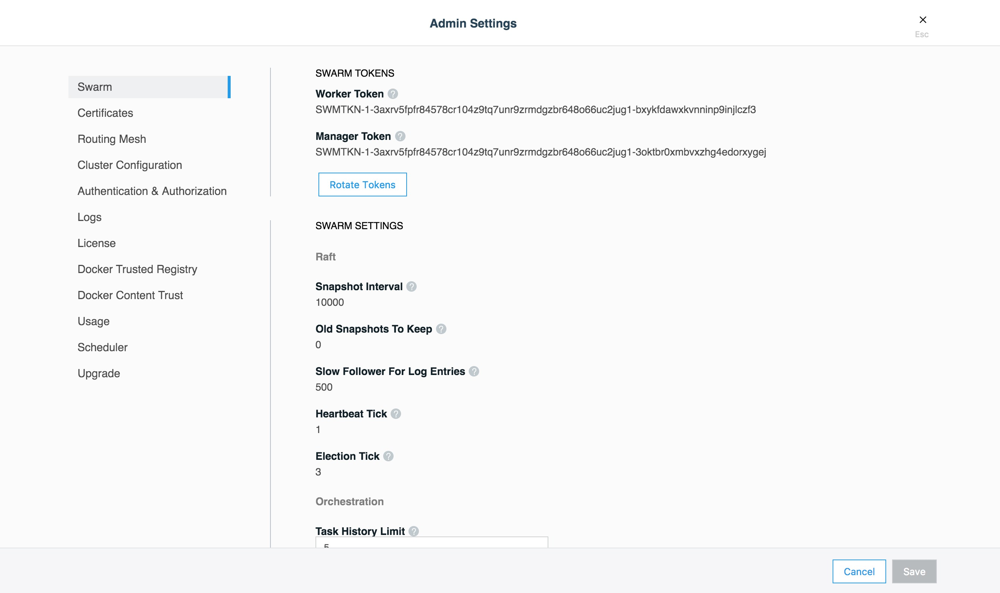

<a name="ucp-key"></a>
### Node Certificate Expiration
UCP's management plane uses a private CA and certificates for all internal communication. The client certificates are automatically rotated on a schedule. Key rotation is a strong method for reducing the effect of a compromised node. There is an option to reduce the time interval, with the default being 90 days. Shorter intervals add stress to the UCP cluster. Similar to rotating the join tokens, go to **Admin --> Admin Settings --> Swarm** and scroll down.

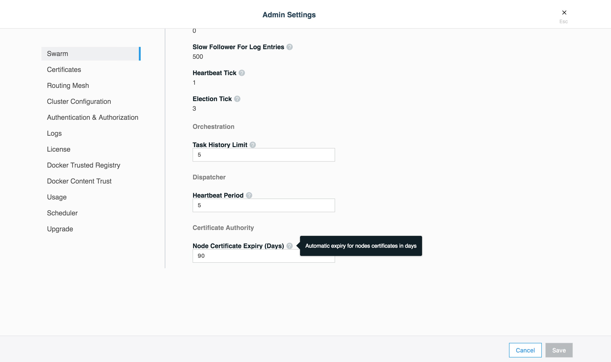

<a name="ucp-client-bundles"></a>
### Client Certificate Bundles
Universal Control Plane makes it easy to create a client certificate bundle for use with the Docker client. The client bundle allows end users to create objects and deploy services from a local Docker client. To create a client bundle, log into UCP, and click the login name in the upper left. Then select **My Profile** -> **Client Bundles**.

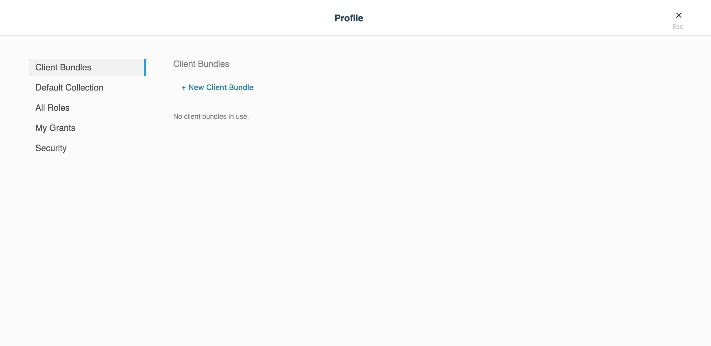

From here a client bundle can be created and downloaded. Inside the bundle are the files necessary for talking to the UCP cluster directly.

Navigate to the directory where you downloaded the user bundle, and unzip it.

```
unzip ucp-bundle-admin.zip
```

Then run the `env.sh` script:

```
eval $(<env.sh)
```

Verify the changes:

```
docker info
```

The `env.sh` script updates the `DOCKER_HOST` environment variable to make your local Docker CLI communicate with UCP. It also updates the `DOCKER_CERT_PATH` environment variables to use the client certificates that are included in the client bundle you downloaded.

From now on, the Docker CLI client will include the client certificates as part of the request to the Docker engine. The Docker CLI can now be used to create services, networks, volumes, and other resources on a swarm managed by UCP.

To stop talking to the UCP cluster run the following command:

```
unset DOCKER_HOST DOCKER_TLS_VERIFY DOCKER_CERT_PATH
```

Run `docker info` to verify that the Docker CLI is communicating with the local daemon.

<a name="ucp-rbac"></a>
### Cluster Role-Based Access Control
Docker EE 17.06 introduced a greatly [enhanced Access Control system](https://docs.docker.com/datacenter/ucp/2.2/guides/access-control/) for [UCP 2.2.](https://docs.docker.com/datacenter/ucp/2.2/guides/release-notes/)  The new Access Control model provides an extremely fine-grained control of what resources users can access within a cluster. Use of RBAC is **highly** recommended for a secure cluster. Security principles of _least privilege_ dictate the use of access control to limit access to resources whenever possible.

#### Access Control Policy

Docker EE Access Control is a policy-based model that uses access control lists (ACLs) called **grants** to dictate access between users and cluster resources. A grant ties together _who_, has permission for _which actions_, against _what resource_. They are a flexible way of implementing access control for complex scenarios without incurring high management overhead for the system administrators.

As shown below, a grant is made up of a *subject* (who), *role* (which permissions), and a *collection* (what resources).


> **Note:** It is the UCP administrators' responsibility to create and manage the grants, subjects, roles, and collections.

#### Subjects

A subject represents a user, team, or organization. A subject is granted a role for a collection of resources. These groups of users are the same across UCP and DTR making RBAC management across the entire software pipeline uniform.

- **User**: A single user or system account that an authentication backend (AD/LDAP) has validated.
- **Team**: A group of users that share a set of permissions defined in the team itself. A team exists only as part of an organization, and all team members are members of the organization. A team can exist in one organization only. Assign users to one or more teams and one or more organizations.
- **Organization**: The largest organizational unit in Docker EE. Organizations group together teams to provide broader scope to apply access policy against.

#### Roles and Permissions

A role is a set of permitted API operations that you can assign to a specific subject and collection by using a grant. Roles define what operations can be done against cluster resources. An organization will likely use several different kinds of roles to give the right kind of access. A given team or user may have different roles provided to them depending on what resource they are accessing. There are default roles provided by UCP, and there is also the ability to build custom roles.

##### Custom Roles

Docker EE defines very granular roles down to the Docker API level to match unique requirements that an organization may have. [Roles and Permission Levels](https://docs.docker.com/datacenter/ucp/2.2/guides/access-control/permission-levels/) has a full list of the operations that can be used to build new roles.

For example, a custom role called 'developer' could be created to allow developers to view and retrieve logs from their own containers that are deployed in production. A developer cannot affect the container lifecycle in any way but can gather enough information about the state of the application to troubleshoot application issues.

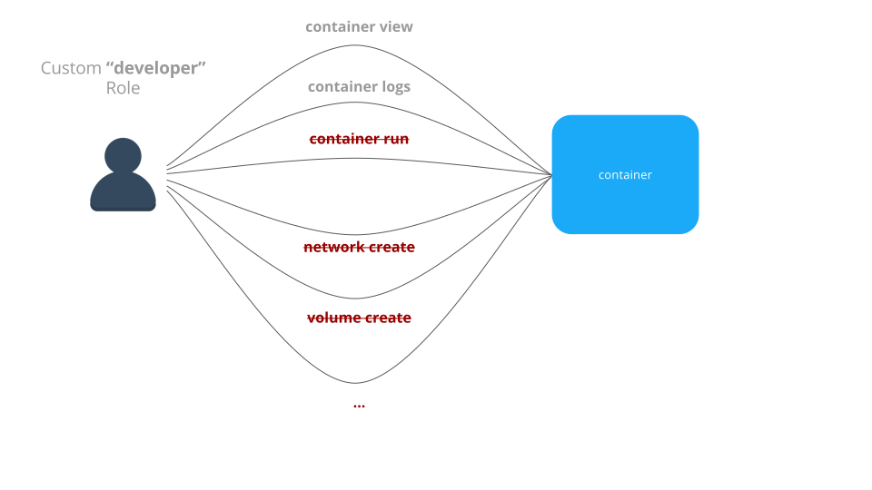

##### Built-In Roles

UCP also provides default roles that are pre-created. These are common role types that can be used to ease the burden of creating custom roles.


| Built-In Role        | Description |
|----------------------|-------------|
| `None`               | The user has no access to swarm resources. This maps to the `No Access` role in UCP 2.1.x. |
| `View Only`          | The user can view resources like services, volumes, and networks but can't create them. |
| `Restricted Control` | The user can view and edit volumes, networks, and images but can't run a service or container in a way that might affect the node where it's running. The user can't mount a node directory and can't `exec` into containers. Also, the user can't run containers in privileged mode or with additional kernel capabilities. |
| `Scheduler`          | The user can view nodes and schedule workloads on them. Worker nodes and manager nodes are affected by `Scheduler` grants. Having `Scheduler` access doesn't allow the user to view workloads on these nodes. They need the appropriate resource permissions, like `Container View`. By default, all users get a grant with the `Scheduler` role against the `/Shared` collection. |
| `Full Control`       | The user can view and edit volumes, networks, and images. They can create containers without any restriction but can't see other users' containers. |


#### Collections
Docker EE enables controlling access to swarm resources by using *collections*. A collection is a grouping of swarm cluster resources that you access by specifying a directory-like path.  Before grants can be implemented, collections need to be designed to group resources in a way that makes sense for an organization.

The following example shows the potential access policy of an organization. Consider an organization with two application teams, Mobile and Payments, that share cluster hardware resources, but still need to segregate access to the applications. Collections should be designed to map to the organizational structure desired, in this case the two application teams.


> **Note:** Permissions to a given collection are inherited by all children of that collection.

Collections are implemented in UCP through the use of Docker labels. All resources within a given collection are labeled with the collection, `/production/mobile` for instance.

Collections are flexible security tools because they are hierarchical. For instance, an organization may have multiple levels of access. This might neccessitate a collection architecture like the following:

```
├── production
│   ├── database
│   ├── mobile
│   └── payments
│       ├── restricted
│       └── front-end
└── staging
    ├── database
    ├── mobile
    └── payments
        ├── restricted
        └── front-end
```

To create a child collection, navigate into the parent collection. Then create the child.


To add objects to collections, leverage labels. When deploying a stack make sure all objects are "labeled." Here is a good example of a few labels :

 * Add an object to the `/production`collection : `com.docker.ucp.access.label: "/production"`
 * Add an object to the `/production/mobile` collection : `com.docker.ucp.access.label: "/production/mobile"`

Adding nodes to a collection takes a little more care. Please follow the [documentation](https://docs.docker.com/datacenter/ucp/2.2/guides/access-control/isolate-nodes-between-teams/#create-a-team) for isolating nodes to specific teams. Isolation nodes is a great way to provide more separation for multi-tenant clusters.

#### Grant Composition

When subjects, collections, and roles are set up, grants are created to map all of these objects together into a full access control policy. The following grant is one of many that might be created:

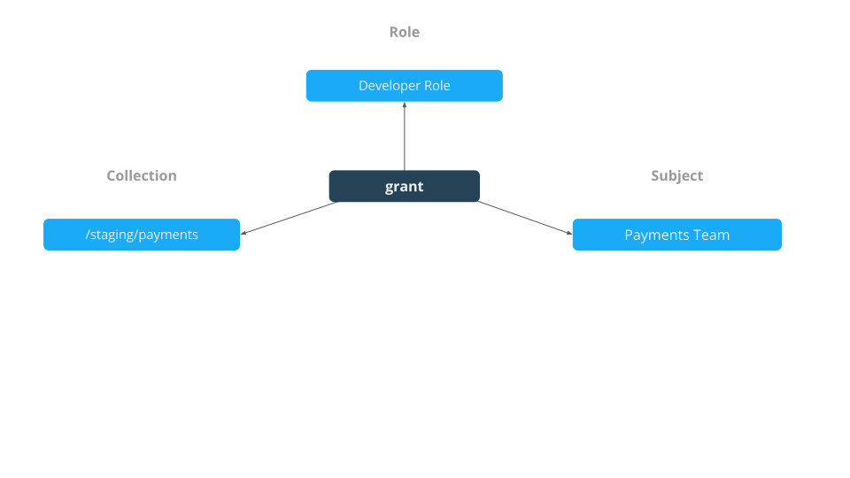

Together the grants clearly define which users have access to which resources. This is a list of some of the default grants in UCP that exist to provide an admin the appropriate access to UCP and DTR infrastructure.

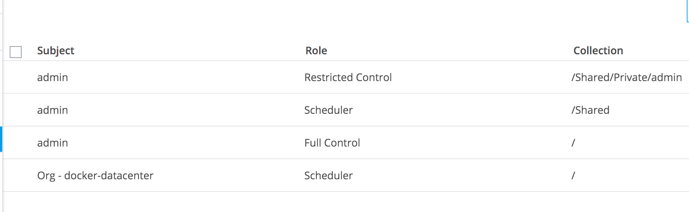

<a name="ucp-secrets"></a>
### Secrets
Secrets are new starting with Docker EE Engine 1.13 as well as Docker EE 17.03. A _secret_ is a blob of data such as a password, SSH private key, SSL certificate, or another piece of data that should not be transmitted over a network. Secrets are stored unencrypted in a Dockerfile or stored in your application's source code. Use Docker secrets to centrally manage this data and securely transmit it only to those containers that need access to it. Secrets follow a Least Privileged Distribution model and are encrypted at rest and in transit in a Docker swarm. A given secret is only accessible to those services which have been granted explicit access to it and only while those service tasks are running.

Secrets requires a swarm mode cluster. Use secrets to manage any sensitive data which a container needs at runtime but shouldn't be stored in the image or in source control such as:

- Usernames and passwords
- TLS certificates and keys
- SSH keys
- Other important data such as the name of a database or internal server
- Generic strings or binary content (up to 500 kb in size)

> **Note**: Docker secrets are only available to swarm services, not to standalone containers. To use this feature, consider adapting the container to run as a service with a scale of 1.

Another use case for using secrets is to provide a layer of abstraction between the container and a set of credentials. Consider a scenario where there have separate development, test, and production environments for an application. Each of these environments can have different credentials, stored in the development, test, and production swarms with the same secret name. The containers only need to know the name of the secret to function in all three environments.

When a secret is added to the swarm, Docker sends the secret to the swarm manager over a mutual TLS connection. The secret is stored in the Raft log, which is encrypted. The entire Raft log is replicated across the other managers, ensuring the same high availability guarantees for secrets as for the rest of the swarm management data.


When a newly-created or running service is granted access to a secret, the decrypted secret is mounted into the container in an in-memory filesystem at `/run/secrets/<secret_name>`. It is possible to update a service to grant it access to additional secrets or revoke its access to a given secret at any time.

A node only has access to (encrypted) secrets if the node is a swarm manager or if it is running service tasks which have been granted access to the secret. When a container task stops running, the decrypted secrets shared to it are unmounted from the in-memory filesystem for that container and flushed from the node's memory.

If a node loses connectivity to the swarm while it is running a task container with access to a secret, the task container still has access to its secrets but cannot receive updates until the node reconnects to the swarm.

Docker EE's strong RBAC system can tie _secrets_ into it with the exact same labels demonstrated before, meaning you should always limit the scope of each secret to a specific team. If there are NO labels applied, the default label is the owner.

For example, TLS certificates can be added as secrets. Using the same RBAC example teams as previously mentioned, the following example adds `ca.pem`, `cert.pub`, and `cert.pem` to the secrets vault. Notice the use of the label `com.docker.ucp.access.label=/prod`. This is important for enforcing the RBAC rules. Also note the use of the team name in the naming of the secret. For another idea for updating or rolling back secrets, consider adding a version number or date to the secret name. This is made easier by the ability to control the mount point of the secret within a given container. This also prevents teams from trying to use the same secret name. The following adds the CA's public certificate in pem format as a secret named `orcabank_prod_mobile.ca.pem.v1`.

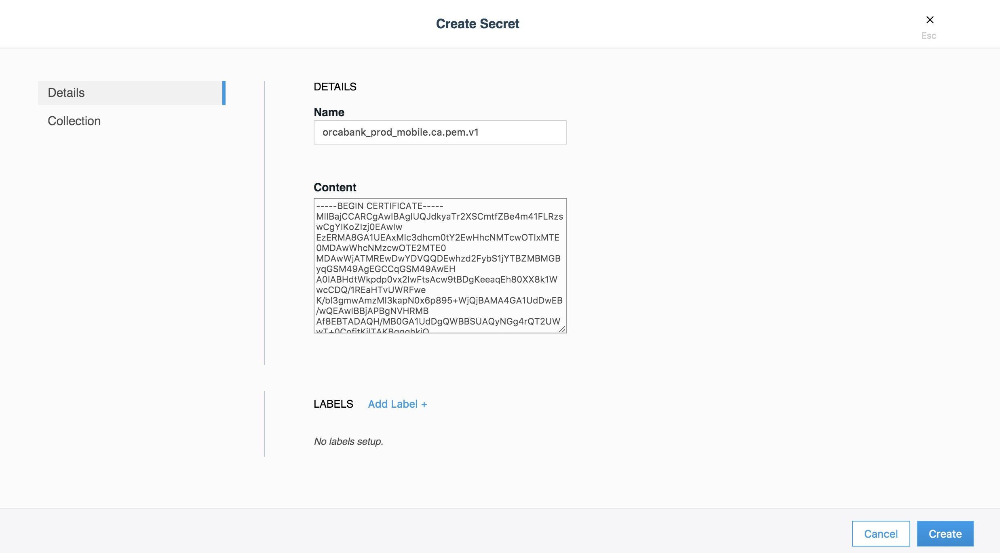

Next, set the collection the secret is in. Using the same example from above, select the `/prod` collection.

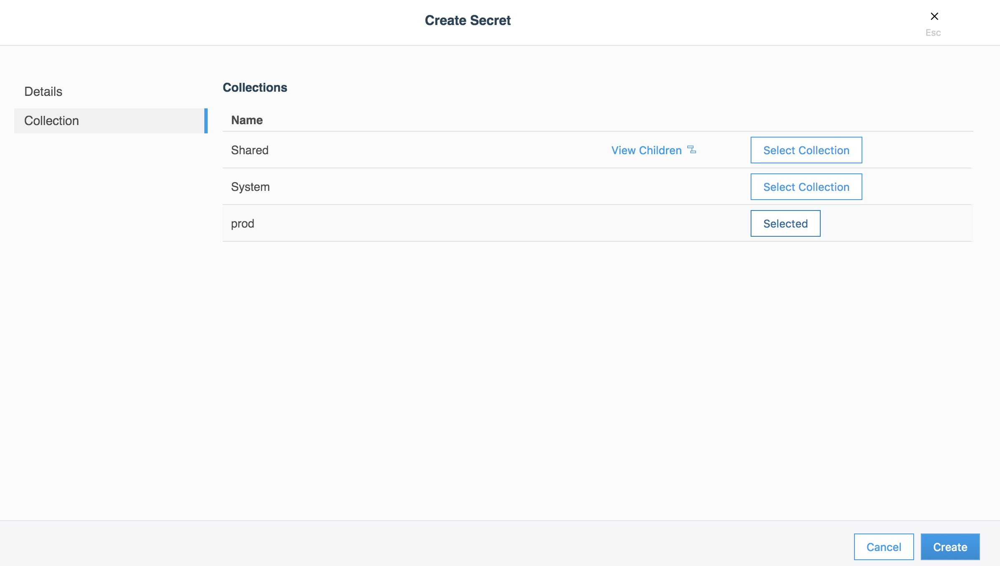

Secrets are only available to services. The following creates an `nginx` service. The service and the secret MUST be in the same collection.  Again, apply the collection through the use of labels. If they don't match, UCP won't allow you to deploy.  The next example deploys a service that can be used as a secret:

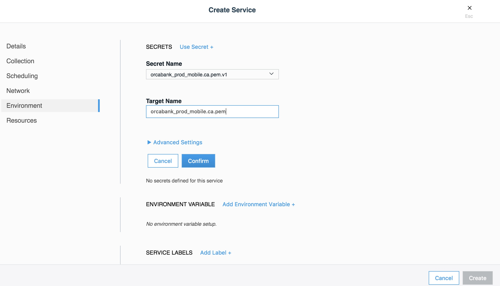

The important part is on the **Environment** tab. Click the **+ Use a secret**. Use the advanced settings to configure the UID/GID and file mode for the secret when it is mounted. Binaries and tarballs can be added as secrets, with a file size up to 500KB. Be sure to click **Confirm** to add the secret.

When using the CLI, the option, `--secret source=,target=,mode=` needs to be added to the `docker service create` command as follows:

```
$ docker service create \
--secret source=orcabank_prod_mobile.ca.pem.v1,target=ca.pem \
--secret source=orcabank_prod_mobile.cert.pub.v1,target=cert.pub \
--secret source=orcabank_prod_mobile.cert.pem.v1,target=cert.pem \
-l com.docker.ucp.access.label=/prod -p 443 --name nginx nginx
```

Notice that the secrets are mounted to `/run/secrets/`. Because of labels in this example, only administrators and the crm team have access to this container and its secrets.

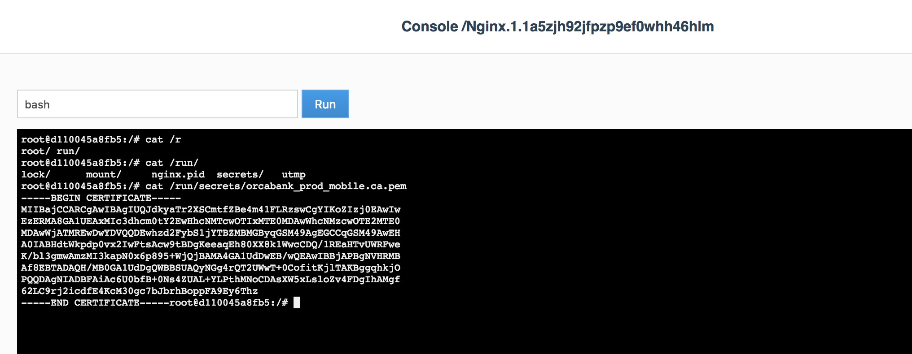

Changing secrets is as easy as removing the current version and creating it again. *Be sure the labels on the new secret are correct.*

<a name="ucp-logging"></a>
### Logging
Since UCP is deployed as a containerized application, it uses the Engine logging configuration automatically. However, there is an easier way to configure logging across the cluster if the syslog format is being used. In **Admin Settings --> Logs** set the logging level and destination.

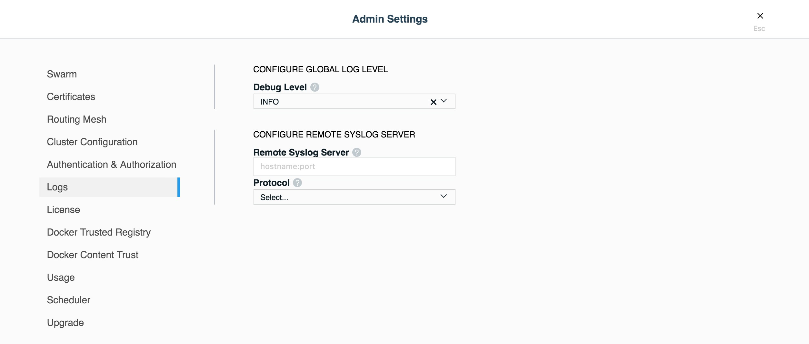

This is a great way to point all the logs to Splunk or an ELK (Elasticsearch Logstash Kibana) stack, as well as change the logging level.

<a name="dtr"></a>
## DTR Security

Docker Trusted Registry continues the "Secure by Default" theme with two new strong features: *Image Signing* (via the Notary project) and *Image Scanning*. Additionally, DTR shares authentication with UCP, which simplifies setup and provides strong RBAC without any effort.

DTR stores metadata and layer data in two separate locations. The metadata is stored locally in a database that is shared between replicas. The layer data is stored in a configurable location.

<a name="dtr-cert"></a>
### External Certificates
Just as with UCP, DTR can use fully-signed company certificates or self-signed certs. The Certificate Authority (CA) for the organization can be used. To reduce the number of certificates, add multiple Subject Alternative Names (SANs) to a single certificate. This allows the certificate to be valid for multiple URLs. For example, when setting up a certificate for `ucp.example.com`, add SANs of `dtr.example.com` and all the underlying hostnames and IP addresses. Using this technique allows the same certificate to be used for both UCP and DTR.

External certificates are added to DTR by going to **Settings** --> **General** --> **Domain & proxies** --> **Show TLS Settings**.

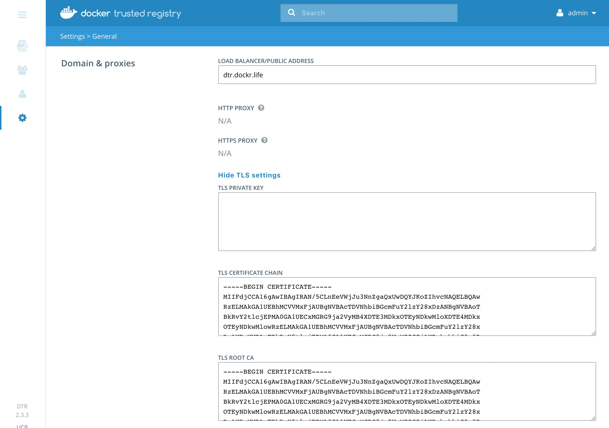

For more instructions on adding external certificates, refer to the [Docker docs](https://docs.docker.com/datacenter/dtr/2.2/guides/admin/configure/use-your-own-tls-certificates/).

<a name="dtr-storage"></a>
### Storage Backend — S3 or NFS
The choice of the storage backend for DTR has effects on both performance and security.  The choices are as follows:

|Type|Pros|Cons|
|---|---|---|
|Local Filesystem|Fast and Local. Pairs great with local block storage.|Requires bare metal or ephemeral volumes. NOT good for HA.|
|S3|Great for HA and HTTPS communications. Several third party servers available. [Can be encrypted at rest.](http://docs.aws.amazon.com/AmazonS3/latest/dev/UsingEncryption.html)|Requires maintaining or paying for an external S3 compliant service.|
|Azure Blob Storage|Can be configured to act as local but have redundancy within Azure Storage. [Can be encrypted at rest.](https://docs.microsoft.com/en-us/azure/storage/common/storage-service-encryption)|Requires Azure cloud account.|
|Swift|Similar to S3 being an object store.|Requires OpenStack infrastructure for service.|
|Google Cloud Storage| Similar to S3 being an object store. Can be encrypted at rest. |Requires a Google Cloud account.|
|NFS|Easy to setup/integrate with existing infrastructure.|Slower due to network calls.|

To change the settings, go to **Settings** --> **Storage** in UCP.

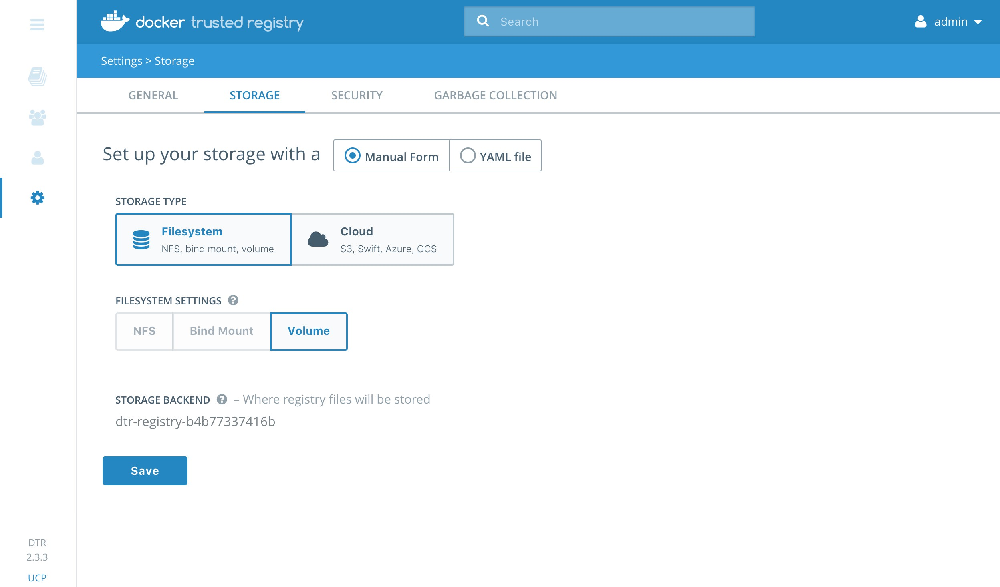

Storage choice is highly influenced by where Docker EE is deployed because it is important to place DTR's backend storage as close as possible to DTR itself. Always ensure that HTTPS (TLS) is being used. Also consider how to backup DTR's images. When in doubt, use a secure object store, such as S3 or similar. Object stores provide the best balance between security and ease of use and also make it easy for HA DTR setups.

<a name="dtr-garbage"></a>
### Garbage Collection
Garbage collection is an often-overlooked area from a security standpoint.  Old, out-of-date images may contain security flaws or exploitable vulnerabilities, so removing unnecessary images is important.  Garbage collection is a feature that ensures that unused images (and layers) are removed. Garbage collection is a substantial process, so it's best to run at times when the system is least utilized. Scheduling a regular collection time in **Settings** --> **Garbage Collection** is the best approach to ensuring unnecessary images are removed.

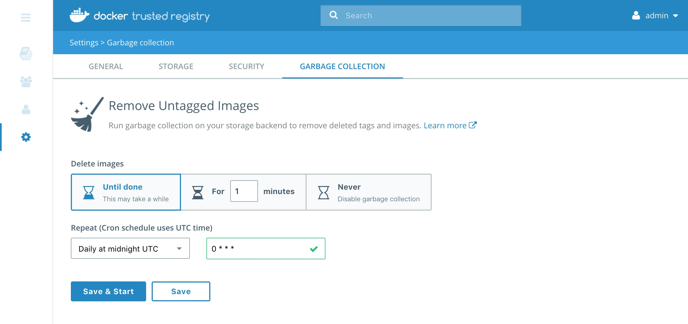

<a name="dtr-rbac"></a>
### Organizations and Teams — RBAC
Since Universal Control Plane and Docker Trusted Registry utilize the same authentication backend, users are shared between the two. This simplifies user management since UCP 2.2 and DTR 2.3 organizations are now shared. That means DTR and UCP can manage the organizations and teams. Consider the differences between organizations and teams. Teams are nested underneath organizations. Teams allow for a finer grain control of access.

Here’s an overview of the permission levels available for organizations and users:

* **Anonymous users**: Search and pull public repositories.
* **Users**: Search and pull public repos. Create and manage their own repositories.
* **Team member**: Can do everything a user can do plus the permissions granted by the teams the user is a member of.
* **Team admin**: Can do everything a team member can do, and can also add members to the team.
* **Organization admin**: Can do everything a team admin can do, can create new teams, and add members to the organization.
* **Admin**: Can manage anything across UCP and DTR.

The following example creates an organization called `crm`:

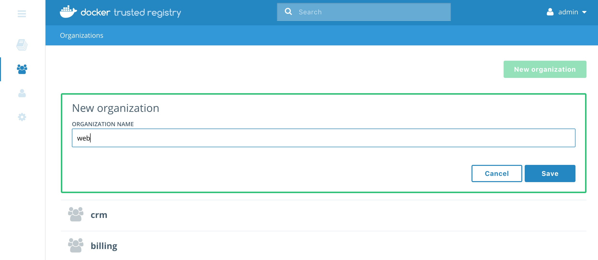

Once the organizations are created, add teams to the organization.

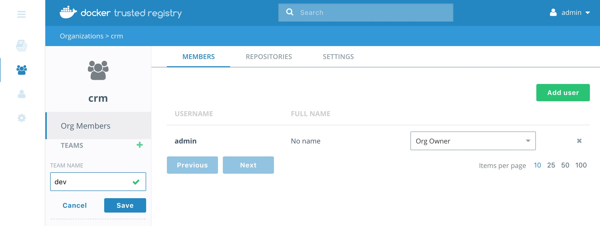

For example, an organization named `crm`, a team named `prod`, and a repository named `crm/awesome_app` were created. Permissions can now be applied to the images themselves.

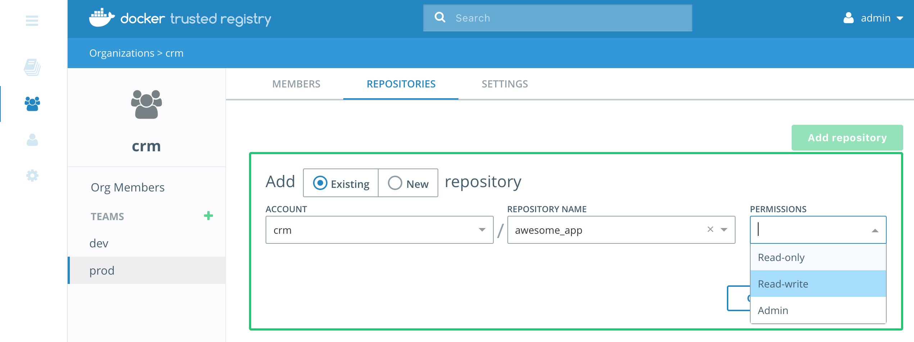

This chart shows the different permission levels for a team against a repository:

| Repository Operation  | read | read-write | admin |
|-----------------------|------|------------|-------|
| View / browse         |   x  |      x     |   x   |
| Pull                  |   x  |      x     |   x   |
| Push                  |      |      x     |   x   |
| Delete tags           |      |      x     |   x   |
| Edit description      |      |            |   x   |
| Set public or private |      |            |   x   |
| Manage user access    |      |            |   x   |
| Delete repository     |      |            |       |

It is important to limit the number of users that have access to images. Applying the permission levels correctly is important. This will help in creating a Secure Supply Chain.

<a name="dtr-notary"></a>
### Content Trust/Image Signing — Notary

*Notary* is a tool for publishing and managing trusted collections of content. Publishers can digitally sign collections and consumers can verify integrity and origin of content. This ability is built on a straightforward key management and signing interface to create signed collections and configure trusted publishers.

Docker Content Trust/Notary provides a cryptographic signature for each image. The signature provides security so that the image requested is the image you get. Read [Notary's Architecture](https://docs.docker.com/notary/service_architecture/) to learn more about how Notary is secure. Since Docker EE is "Secure by Default," Docker Trusted Registry comes with the Notary server out of the box.

In addition, Docker Content Trust allows for threshold signing and gating for the releases. Under this model, software is not released until all necessary parties (or a quorum) sign off. This can be enforced by requiring (and verifying) the needed signatures for an image. This policy ensures that the image has made it through the whole process: if someone tries to make it skip a step, the image will lack a necessary signature, thus preventing deployment of that image.

The following examples shows the basic usage of Notary. To use image signing, create a repository in DTR and enable it on the local Docker engine. First, enable the client, and sign an image:

```
root @ ~  export DOCKER_CONTENT_TRUST=1
root @ ~  docker tag alpine dtr.example.com/admin/alpine:signed
root @ ~  docker push dtr.example.com/admin/alpine:signed
The push refers to a repository [dtr.example.com/admin/alpine]
865e1c468a35: Layer already exists
e0cfcaccf697: Layer already exists
e2d4ee32e967: Layer already exists
60ab55d3379d: Layer already exists
signed: digest: sha256:131d77d4ccf5916a94d026e2f5865a2e2acefd56fc6debceb83e50cf24eb4e99 size: 1156
Signing and pushing trust metadata
You are about to create a new root signing key passphrase. This passphrase
will be used to protect the most sensitive key in your signing system. Please
choose a long, complex passphrase and be careful to keep the password and the
key file itself secure and backed up. It is highly recommended that you use a
password manager to generate the passphrase and keep it safe. There will be no
way to recover this key. You can find the key in your config directory.
Enter passphrase for new root key with ID 44d193b:
Repeat passphrase for new root key with ID 44d193b:
Enter passphrase for new repository key with ID 2a0738c (dtr.example.com/admin/alpine):
Repeat passphrase for new repository key with ID 2a0738c (dtr.example.com/admin/alpine):
Finished initializing "dtr.example.com/admin/alpine"
Successfully signed "dtr.example.com/admin/alpine":signed

```
The above does the following:

* Enables Content Trust with `export DOCKER_CONTENT_TRUST=1`
* Tags an image destined for DTR with `docker tag alpine dtr.example.com/admin/alpine:signed`
* Pushes the image with the tag "signed" with `docker push dtr.example.com/admin/alpine:signed`
* The Docker client starts the push to DTR. Since there is no local root key (certificate), it needs to be created with a passphrase. `Enter passphrase for new root key with ID 44d193b:`
* A repository key is created with a passphrase. `Enter passphrase for new repository key with ID f93c4a5 (dtr.example.com/admin/alpine):`

When re-pushing signed images to DTR, the keys do not need to be created again. It will prompt for the image passphrase.

```
root @ ~  docker push dtr.example.com/admin/alpine:signed
The push refers to a repository [dtr.example.com/admin/alpine]
60ab55d3379d: Layer already exists
signed: digest: sha256:3952dc48dcc4136ccdde37fbef7e250346538a55a0366e3fccc683336377e372 size: 528
Signing and pushing trust metadata
Enter passphrase for repository key with ID 2a0738c:
Successfully signed "dtr.example.com/admin/alpine":signed
```

A successfully signed image has a green check mark in the DTR GUI.

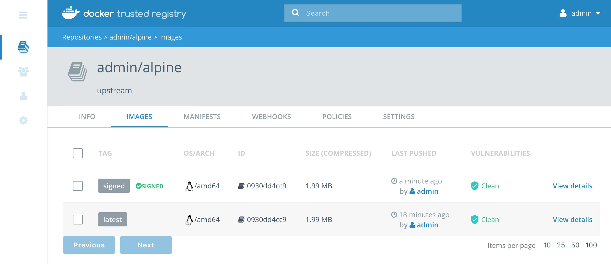

<a name="dtr-key-management"></a>
#### Key Management

Docker and Notary clients store state in its `trust_dir` directory, which is `~/.docker/trust` when enabling Docker Content Trust. This directory is where all the keys are stored. All the keys are encrypted at rest. It is VERY important to protect that directory with permissions.

The `root_keys` subdirectory within `private` stores root private keys, while `tuf_keys` stores targets, snapshots, and delegations private keys.

Interacting with the local keys requires the installation of the Notary client. Binaries can be found at [https://github.com/docker/notary/releases](https://github.com/docker/notary/releases). Here is a quick installation script:

```
$ wget -O /usr/local/bin/notary https://github.com/docker/notary/releases/download/v0.4.3/notary-Linux-amd64
$ chmod 755 /usr/local/bin/notary
```
At the same time, getting the notary client DTR's CA public key is also needed.

```
$ mkdir -o ~/.docker/tls/dtr.example.com; curl -sk https://dtr.example.com/ca -o ~/.docker/tls/dtr.example.com/ca.crt
```

It is easy to simplify the notary command with an alias.

```
$ alias notary="notary -s https://dtr.example.com -d ~/.docker/trust --tlscacert ~/.docker/tls/dtr.example.com/ca.crt"
```

With the alias in place, run `notary key list` to show the local keys and where they are stored.

```
ROLE       GUN                          KEY ID                                                              LOCATION
----       ---                          ------                                                              --------
root                                    44d193b5954facdb5f21584537774b9732cfea91e5d7531075822c58f979cc93    /root/.docker/trust/private
targets    ...ullet.com/admin/alpine    2a0738c4f75e97d3a5bbd48d3e166da5f624ccb86899479ce2381d4e268834ee    /root/.docker/trust/private
```

To make the keys more secure it is recommended to always store the `root_keys` offline, meaning, not on the machine used to sign the images. If that machine were to get compromised, then an unauthorized person would have everything needed to sign "bad" images. Yubikey is a really good method for storing keys offline.

<a name="notary-yubikey"></a>
##### Use a Yubikey
Notary can be used with a hardware token storage device called a [Yubikey](https://www.yubico.com/products/yubikey-hardware/). The Yubikey must be prioritized to store root keys and requires user touch-input for signing. This creates a two-factor authentication for signing images. Note that Yubikey support is included with the Docker Engine 1.11 client for use with Docker Content Trust. The specific use is to have all of your developers use Yubikeys with their workstations. Get more information about Yubikeys from the [Docker docs](https://docs.docker.com/notary/advanced_usage/#/use-a-yubikey).

<a name="notary-jenkins"></a>
##### Signing with Jenkins
When teams get large, it becomes harder to manage all the developer keys. One method for reducing the management load is to not let developers sign images. Using Jenkins to sign all the images that are destined for production eliminates most of the key management. The keys on the Jenkins server still need to be protected and backed up.

The first step is to create a user account for your CI system. For example, assume Jenkins is the CI system. As an admin user, navigate to **Organizations** and select **New organization**. Assume it is called "ci". Next, add a Jenkins user by navigating into the organization and selecting **Add User**. Create a user with the name `jenkins` and set a strong password. This will create a new user and add the user to the "ci" organization. Next, give the Jenkins user "Org Admin" status so the user is able to manage the repositories under the "ci" organization.

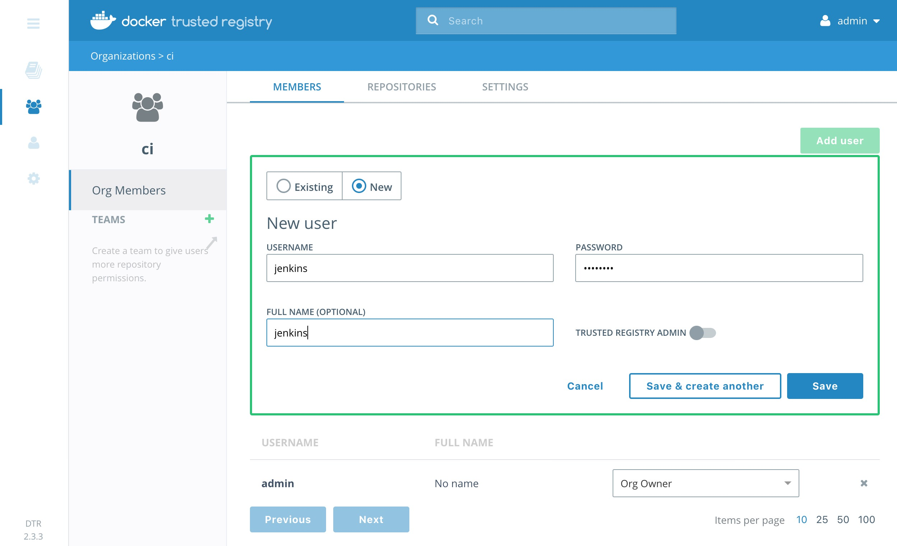

Navigate to UCP's **User Management** and create a team under the "ci" organization. Assume this team is named "jenkins".

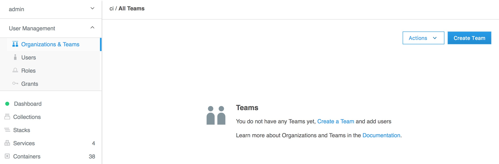

Now that the team is setup, turn on the policy enforcement. Navigate to **Admin Settings** and then the **Docker Content Trust** subsection. Select the "**Run Only Signed Images**" checkbox to enable Docker Content Trust. In the select box that appears, select the "jenkins" team that was just created. Save the settings.

This policy requires every image that is referenced in a `docker pull`, `docker run`, or `docker service create` be signed by a key corresponding to a member of the "jenkins" team. In this case, the only member is the `jenkins` user.

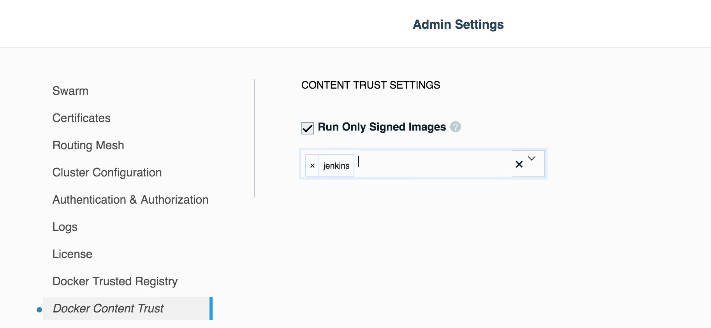

The signing policy implementation uses the certificates issued in user client bundles to connect a signature to a user. Using an incognito browser window (or otherwise), log into the `jenkins` user account created earlier. Download a client bundle for this user. It is also recommended to change the description associated with the public key stored in UCP such that it can be identify in the future as the key being used for signing.

Please note each time a user retrieves a new client bundle, a new keypair is generated. It is therefore necessary to keep track of a specific bundle that a user chooses to designate as the user's signing bundle.

Once the client bundle has been decompressed, the only two files needed for the purpose of signing are `cert.pem` and `key.pem`. These represent the public and private parts of the user’s signing identity respectively. Load the `key.pem` file onto the Jenkins servers, and use `cert.pem` to create delegations for the `jenkins` user in the Trusted Collection.

On the Jenkins server, use the notary client to load keys. Simply run `notary -d /path/to/.docker/trust key import /path/to/key.pem`. When prompted, set a password to encrypt the key on disk. For automated signing, this password can be configured into the environment under the variable name `DOCKER_CONTENT_TRUST_REPOSITORY_PASSPHRASE`. The `-d` flag to the command specifies the path to the trust subdirectory within the server’s Docker configuration directory. Typically this is found at `~/.docker/trust`.

There are two ways to enable Content Trust: globally and per operation. To enabled Content Trust globally, set the environment variable `DOCKER_CONTENT_TRUST=1`. To enable on a per operation basis, wherever `docker push` is run in the Jenkins scripts, add the flag `--disable-content-trust=false`. To sign only certain images, use the second option.

The Jenkins server is now prepared to sign images, but delegations are needed to reference the key to give it the necessary permissions.

Any commands displayed in this section should not be run from the Jenkins server. They can be run them from the local system.

If this is a new repository, create it in Docker Trusted Registry (DTR).

Next, initialize the trust data and create the delegation that provides the Jenkins key with permissions to sign content. The following commands initialize the trust data and rotate snapshotting responsibilities to the server. This is necessary to ensure human involvement it not required to publish new content.

Create an alias to streamline all of the following commands. The alias sets the server and the default trust store location. Adding the CA for DTR's TLS certificate is needed if the certificate is signed by a root server.

```
$ alias notary="notary -s https://dtr.example.com -d ~/.docker/trust --tlscacert ~/.docker/tls/dtr.example.com/ca.crt"
```

Initialize the repository if the signed image hasn't been pushed:

```
$ notary init dtr.example.com/admin/alpine
$ notary key rotate dtr.example.com/admin/alpine snapshot -r
$ notary publish dtr.example.com/admin/alpine
```

Now that the repository is initialized, create the delegations for Jenkins. Docker Content Trust treats a delegation role called `targets/releases` in a special way. It considers this delegation to contain the canonical list of published images for the repository. It is therefore generally desirable to add all users to this delegation with the following command:

```
$ notary delegation add dtr.example.com/admin/alpine targets/releases --all-paths /path/to/cert.pem
```

This solves a number of prioritization problems that would result from needing to determine which delegation should ultimately be trusted for a specific image. However, because it is anticipated that any user will be able to sign the targets/releases role, it is not trusted in determining if a signing policy has been met. Therefore it is also necessary to create a delegation specifically for Jenkins:

```
$ notary delegation add dtr.example.com/admin/alpine targets/jenkins --all-paths /path/to/cert.pem
```

Next publish both these updates (remember to add the correct `-s` and `-d` flags):

```
$ notary publish dtr.example.com/admin/alpine
```

> **Informational (Advanced)**: When including the targets/releases role in determining if a signing policy had been met, there is the potential of images being opportunistically deployed when an appropriate user signs it. In the scenario described so far, only images signed by the `CI` team (containing only the `jenkins` user) should be deployable. If a user `Moby` could also sign images but was not part of the `CI` team, he might sign and publish a new target/release that contained his image. UCP would refuse to deploy this image because it was not signed by the `CI` team. However, the next time Jenkins published an image, it would update and sign the targets/releases role as whole, enabling `Moby` to deploy his image.

<a name="notary-delegate"></a>
##### Key Delegation
Similar to delegating a key for Jenkins, multiple keys can be delegate for teams. There are a few tricks for this. When adding a delegation, it is recommended to add the delegation for the targets/releases role as well as a role to indicate the team.

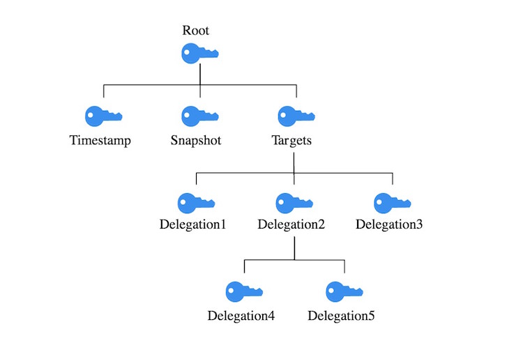

For example, with three teams (`developer`, `qa`, and `devops`) in the targets/releases role, it would be best to add each to the targets/releases role and also create a role for each key:

```
# Keep in mind the '-p' is to automatically publish.
# create delegation for the targets/releases role for each of the keys
$ notary delegation add -p dtr.exampleexample.com/admin/alpine targets/releases --all-paths ~/developer.pem ~/qa.pem ~/devops.pem

# create delegation to the targets/developer role
$ notary delegation add -p dtr.example.com/admin/alpine targets/developer --all-paths ~/developer.pem

# create delegation to the targets/qa role
$ notary delegation add -p dtr.example.com/admin/alpine targets/qa --all-paths ~/qa.pem

# create delegation to the targets/devops role
$ notary delegation add -p dtr.example.com/admin/alpine targets/devops --all-paths ~/devops.pem
```

This is ideal so in the case of everyone pushing to the same tag, it results in the same hash in targets/developer, targets/qa, and targets/devops, and then whoever signed last also signed the same hash into targets/releases. Without the signature on targets/releases, the image can't be pulled. With individual roles for each, additional data is given about which signatures are actually in place based off of which key.


<a name="notary-lost"></a>
##### Lost key? Rotate it?
If the root or signing key is lost, all hope is not lost. The keys can simply be rotated. Then re-pushing the image will trigger a resigning.

To rotate the "targets" (signing) key:

```
root @ ~  notary key rotate dtr.example.com/admin/alpine targets
Enter passphrase for new targets key with ID 00aeaf3 (dtr.example.com/admin/alpine):
Repeat passphrase for new targets key with ID 00aeaf3 (dtr.example.com/admin/alpine):
Enter username: admin
Enter password:
Enter passphrase for root key with ID 2a0738c:
Successfully rotated targets key for repository dtr.example.com/admin/alpine
```

Notice that a new passphrase is entered for the target key. Also note that Notary removes the old targets key and replaces it with the new one. The behavior is a little different for the root key. Notary keeps the old root key to ensure the downstream clients can transition. Next, rotate the root key:

```
root @ ~  notary key rotate dtr.example.com/admin/alpine root
Warning: you are about to rotate your root key.

You must use your old key to sign this root rotation. We recommend that
you sign all your future root changes with this key as well, so that
clients can have a smoother update process. Please do not delete
this key after rotating.

Are you sure you want to proceed?  (yes/no)  yes
You are about to create a new root signing key passphrase. This passphrase
will be used to protect the most sensitive key in your signing system. Please
choose a long, complex passphrase and be careful to keep the password and the
key file itself secure and backed up. It is highly recommended that you use a
password manager to generate the passphrase and keep it safe. There will be no
way to recover this key. You can find the key in your config directory.
Enter passphrase for new root key with ID 75cb534:
Repeat passphrase for new root key with ID 75cb534:
Enter username: admin
Enter password:
Successfully rotated root key for repository dtr.example.com/admin/alpine
```

Remember to keep the keys private, and when possible, use a hardware token like a Yubikey. Currently only the Yubikey version 4 is compatible.

<a name="dtr-key-list"></a>
#### Key Verification

There are some more useful notary commands to list and even unsign images:

```
### verify image is signed
$ notary list dtr.example.com/admin/alpine -r targets/releases
$ notary list dtr.example.com/admin/alpine -r targets/admin

### unsign image
$ notary remove -p dtr.example.com/admin/alpine latest -r targets/releases
$ notary remove -p dtr.example.com/admin/alpine latest -r targets/admin

### verify image is no longer signed
$ notary list dtr.example.com/admin/alpine -r targets/releases
$ notary list dtr.example.com/admin/alpine -r targets/admin
```


<a name="dtr-scan"></a>
### Image Scanning
Starting with version 2.2.0, DTR includes on-premises image scanning. The on-prem scanning engine within DTR scans images against the [CVE Database](https://cve.mitre.org/). First, the scanner performs a binary scan on each layer of the image, identifies the software components in each layer, and indexes the SHA of each component. This binary scan evaluates the components on a bit-by-bit basis, so vulnerable components are discovered regardless of filename, whether or not they're included on a distribution manifest or in a package manager, whether they are statically or dynamically linked, or even if they are from the base image OS distribution.

The scan then compares the SHA of each component against the CVE database (a "dictionary" of known information security vulnerabilities). When the CVE database is updated, the scanning service reviews the indexed components for any that match newly discovered vulnerabilities. Most scans complete within a few minutes, however larger repositories may take longer to scan depending on available system resources. The scanning engine provides a central point to scan all the images and delivers a Bill of Materials (BOM), which can be coupled with [Notary](#dtr-notary) to ensure an extremely secure supply chain for the images.

As of DTR 2.3.0, the Scanning Engine now can scan Windows binaries.


<a name="dtr-scan-setup"></a>
#### Setup Image Scanning
Before beginning, make sure the DTR license includes Docker Security Scanning and that the Docker ID being used can access and download this license from the Docker Store.

To enable Image Scanning, go to **Settings --> Security**, and select **Enable Scanning**. Then select whether to use the Docker-supplied CVE database (**Online** — the default option) or use a locally-uploaded file (**Offline** — this option is only recommended for environments that are isolated from the Internet or otherwise can't connect to Docker for consistent updates). Once enabled in online mode, DTR downloads the CVE database from Docker, which may take a while for the initial sync. If the installation cannot access `https://dss-cve-updates.docker.com/` manually upload a `.tar` file containing the security database.

* If using **Online** mode, the DTR instance contacts a Docker server, download the latest vulnerability database, and install it. Scanning can begin once this process completes.
* If using **Offline** mode, use the instructions in **Update scanning database - offline mode** to upload an initial security database.

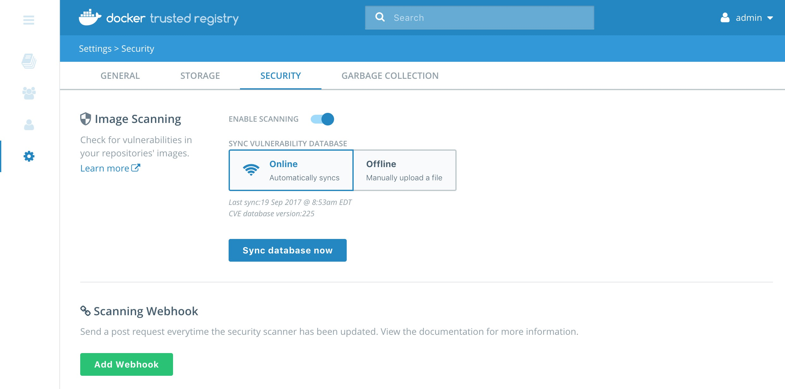

By default, when Security Scanning is enabled, new repositories automatically scan on `docker push`, but any repositories that existed before scanning was enabled are set to "scan manually" mode by default. If these repositories are still in use,  this setting can be changed from each repository's **Settings** page.

<a name="dtr-scan-offline"></a>
#### CVE Offline Database
If the DTR instance cannot contact the update server, download and install a `.tar` file that contains the database updates. These offline CVE database files can be retrieved from [Store.docker.com](https://store.docker.com) under **My Content** --> **License Setup**.


<a name="dtr-scan-results"></a>
#### Scanning Results
To see the results of the scans, navigate to the repository itself, then click **Images**. A clean image scan has a green checkmark shield icon:

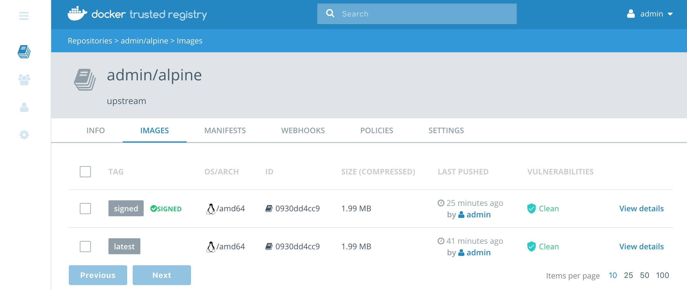

A vulnerable image scan has a red warning shield:


There are two views for the scanning resultsL **Layers** and **Components**. The **Layers** view shows which layer of the image had the vulnerable binary. This is extremely useful when diagnosing where the vulnerability is in the Dockerfile:

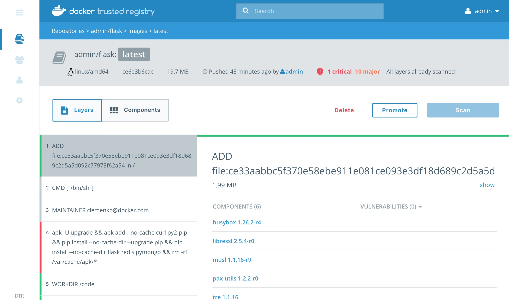

The vulnerable binary is displayed, along with all the other contents of the layer, when the layer itself is clicked on. In this example there are a few potentially vulnerable binaries:

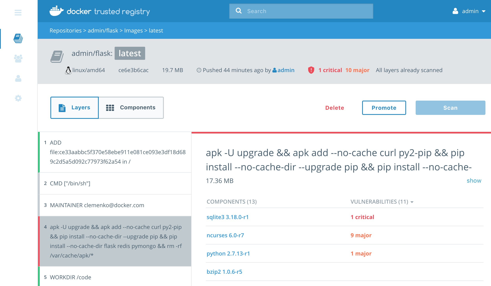

Click the vulnerable image to see the **Components** view. From the **Component** view, the CVE number, a link to CVE database, file path, layers affected, severity, and description of severity are available:


Now it is possible to take action against and vulnerable binary/layer/image.

If vulnerable components are discovered, check if there is an updated version available where the security vulnerability has been addressed. If necessary, contact the component's maintainers to ensure that the vulnerability is being addressed in a future version or patch update.

If the vulnerability is in a `base layer` (such as an operating system) it might not be possible to correct the issue in the image. In this case, switching to a different version of the base layer or finding an equivalent, less vulnerable base layer might help. Deciding that the vulnerability or exposure is acceptable is also an option.

Address vulnerabilities in the repositories by updating the images to use updated and corrected versions of vulnerable components, or by using different components that provide the same functionality. After updating the source code, run a build to create a new image, tag the image, and push the updated image to the DTR instance. Then re-scan the image to confirm that the vulnerabilities have been addressed.

What happens when there are new vulnerabilities released? There are actually two phases. The first phase is to fingerprint the image's binaries and layers into hashes. The second phase is to compare the hashes with the CVE database. The fingerprinting phase takes the longest amount of time to complete. Comparing the hashes is very quick. When there is a new CVE database, DTR simply compares the existing hashes with the new database. This process is also very quick. The scan results are always updated.

<a name="dtr-webhooks"></a>
#### Webhooks
As of DTR 2.3.0 webhooks can be managed through the GUI. DTR includes webhooks for common events, such as pushing a new tag or deleting an image. This allows you to build complex CI and CD pipelines from your own DTR cluster.

The webhook events you can subscribe to are as follows (specific to a repository):

* Tag push
* Tag delete
* Manifest push
* Manifest delete
* Security scan completed

To subscribe to an event requires admin access to the particular repository. A global administrator can subscribe to any event. For example, a user must be an admin of repository to subscribe to its tag push events.

More information about webhooks can be found in the [Docker docs](https://docs.docker.com/datacenter/dtr/2.3/guides/user/create-and-manage-webhooks/). DTR also presents the API by going to the menu under the login in the upper right, and then clicking **API docs**.

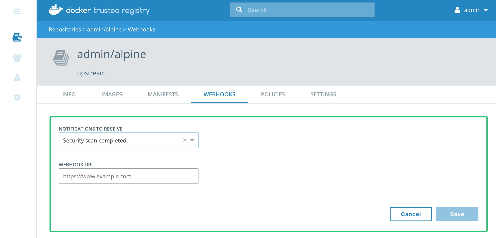

<a name="dtr-immutability"></a>
#### Image Immutability
As of DTR 2.3.0, there is an option to set a repository to **Immutable**. Setting a repository to **Immutable** means the tags can not be overwritten. This is a great feature for ensure the base images do not change over time. This next example is of the Alpine base image. Ideally CI would update the base image and push to DTR with a specific tag. Being **Immutable** simply guarantees that an authorized user can always go back to the specific tag and trust it has not changed. An Image Promotion Policy can extend on this.

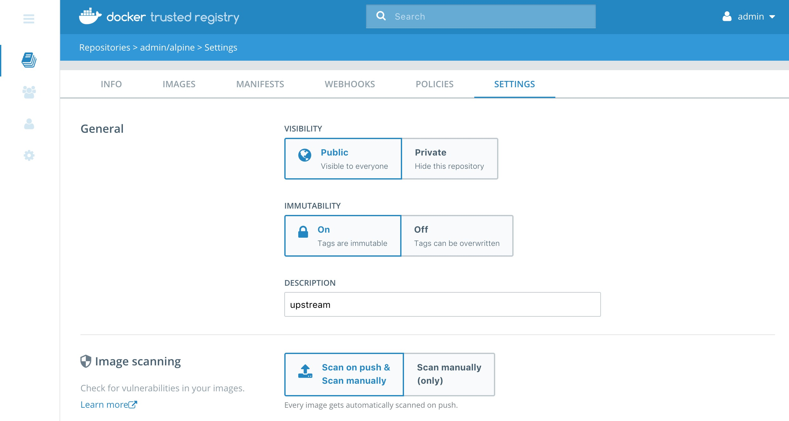

<a name="dtr-promotion"></a>
#### Image Promotion Policy
The release of Docker Trusted Registry 2.3.0 added a new way to promote images. Policies can be created for promotion based upon thresholds for vulnerabilities, tag matching, and package names, and even the license. This gives great powers in automating the flow of images. It also ensures that images that don't match the policy don't make it to production. The criteria are as follows:

* Tag Name
* Package Name
* All Vulnerabilities
* Critical Vulnerabilities
* Major Vulnerabilities
* Minor Vulnerabilities
* All Licenses

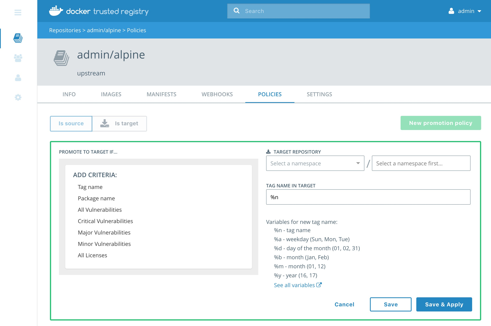

Policies can be created and viewed from either the source or the target. Consider the example of **All Vulnerabilities** to setup a promotion policy for the `admin/alpine` repo to "promote" to `admin/trusted_alpine` if there are zero vulnerabilities. Navigate to the source repository and go to the **Policies** tab. From there select **New Promotion Policy**. Select the **All Vulnerabilities** on the left. Then click **less than or equals** and enter `0` (zero) into the textbox,and click **Add**. Select a target for the promotion. On the right hand side select the namespace and image to be the target. Now click **Save & Apply**.  Applying the policy will execute against the source repository. **Save** will apply the policy to future pushes.

Notice the **Tag Name In Target** that allows changes to the tag according to some variables. It is recommended to start with leaving the tag name the same. For more information please check out the [Image Promotion Policy docs](https://docs.docker.com/datacenter/dtr/2.3/guides/user/create-promotion-policies/).

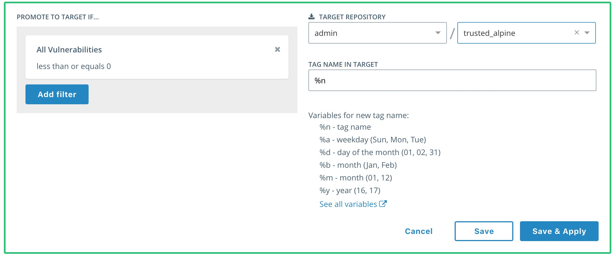

Notice the **PROMOTED** badge. One thing to note is that the Notary signature is not promoted with the image. This means a CI system will be needed to sign the promoted images. This can be achieved with the use of webhooks and promotion policy.

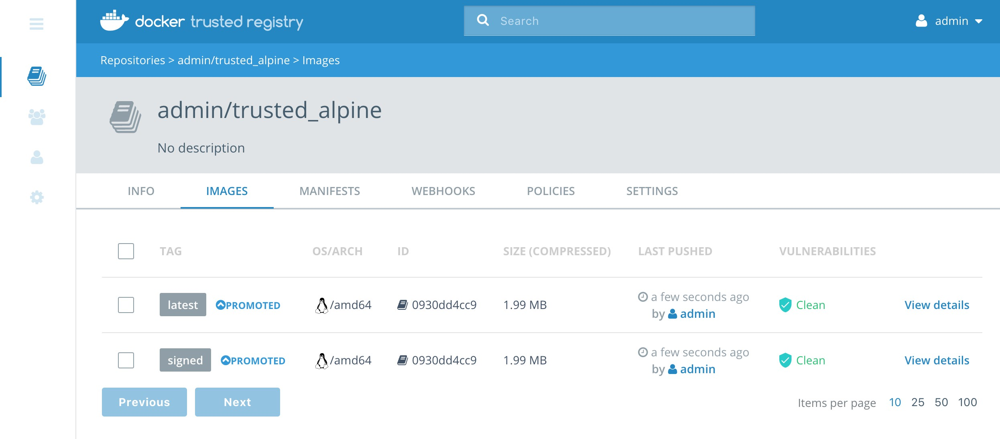

Imagine a DTR setup where the base images get pushed from Jenkins to DTR. Then the images get scanned and promoted if they have zero vulnerabilities. Sounds like a good part of a **Secure Supply Chain**.


<a name="putting-it-all-together"></a>
## Summary

From limiting root access to nodes to using RBAC for UCP and DTR to storing secrets securely, this document provides all the security information needed to create a secure, customized, containerized infrastructure.
