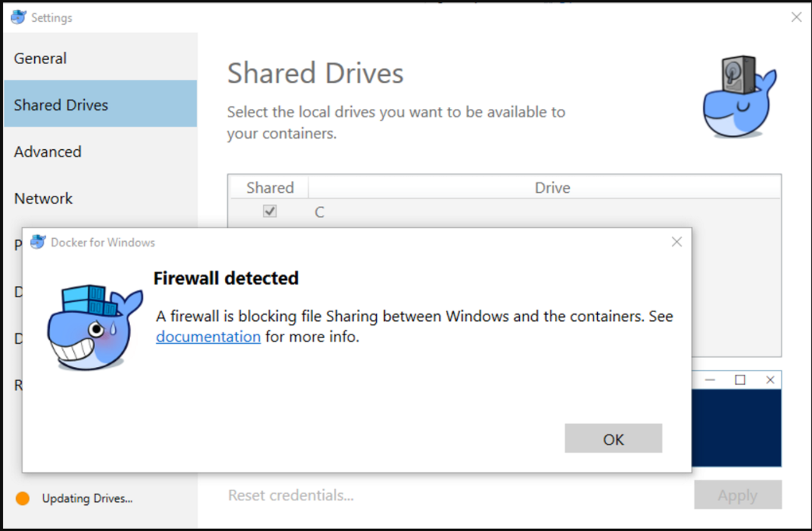

## Issue

When you try to share a drive through the Docker for Windows GUI, you can receive a firewall error when Docker can't connect to the drive through the DockerNat network:

```
Error: A firewall is blocking file Sharing between Windows and the containers  

  
[08:31:08.187][ApiProxy ][Info ] Cancel connection...  

[08:31:08.191][SambaShare ][Error ] Unable to mount C drive: firewall is blocking  

[08:31:08.191][SambaShare ][Info ] Removing share C
```



## Prerequisites

Before performing these steps, you must meet the following requirements:

* Docker for Windows version 17.06.0-ce-win18 12627
* Windows 10

## Troubleshooting Steps and Explanation

There could be a few issues that cause this error. This is not an exhaustive list, but it may help.

Drives aren't accessed directly through Windows Explorer. They are accessed through an internal virtual network called DockerNAT.

DockerNAT uses SMB sharing and CIFS protocols to share volumes and translate file structures between Windows and your Linux containers over UDP ports 137 and 138 and TCP ports 139 and 445 By default, DockerNat uses 10.0.75.1 and 10.0.75.2 internally, but this can be changed or verified through the GUI under **Network Settings**.

Basically this means that even though Docker is locally installed, it accesses your C: drive over the network like this \\10.0.75.1\C:\$ instead of like this C:\$.

1. Check to see if the correct firewall rules are enabled. Docker auto creates local Windows firewall rules on installation, but specifically check that **File and Printer Sharing** is not blocked. 
    1. Windows GUI: **File and Printer Sharing (NB-Session-In)** and **File and Printer Sharing (SMB-In)**
    2. Or you can check using Powershell: `Get-NetFirewallRule –DisplayGroup "File and Printer Sharing"`
2. Check Connectivity. 
    1. Can you connect to 10.0.75.1 445 via telnet?
    2. Are you listening on port 445 and 139? `netstat -ao | find "445"`
    3. Is everything disconnected? What are the results of a `docker login` command?
3. Check Docker network DNS settings. 
    1. Right click the whale icon in your systray.
    2. Go to **Settings**. Change DNS server to a fixed address: `8.8.8.8`
    3. To trigger a network refresh in Docker change to fixed, click **Apply** then toggle back to auto and apply again.
4. Make sure that the DockerNAT network is trusted in your AV firewall or Endpoint protection software. 
    1. IP range: 10.0.75.1/24 Adapter and Network name: (vEthernet (DockerNAT))

## What's Next

If it still isn't working, file an issue with Docker using the Diagnose and Feedback option.
