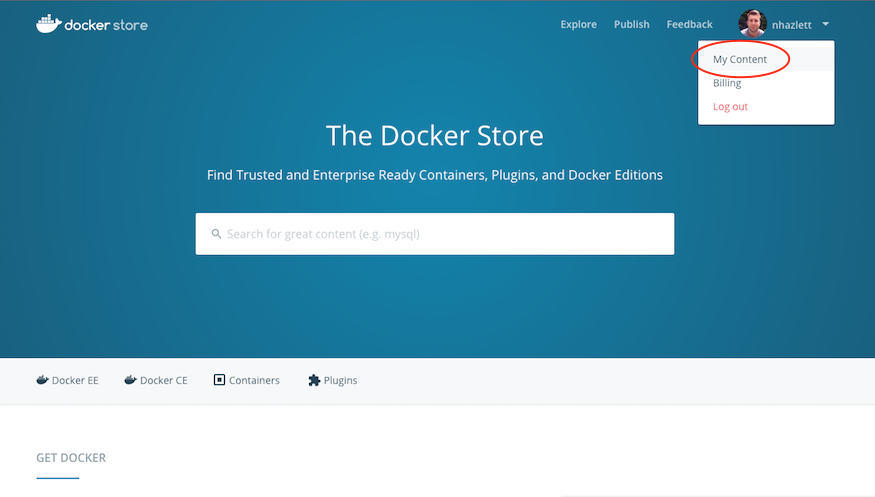
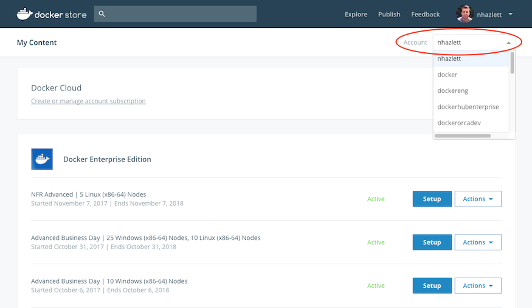

---
# Refer to https://github.com/docker/kbase/blob/master/standards/readme.md for detailed description of metadata
title: How do I access my Docker Enterprise Edition subscription? 
internal: no             
comment: ""
type: kbase               
author:  nhazlett
product:       # Optional. Keep all that apply.
  - ee         # EE (Docker EE - Basic, Standard, and Advanced)
  - Hub        # Docker Hub - and all related Store and Cloud functionality while those sites are being deprecated
testedon:           
---

Once a Docker Enterprise Edition subscription has been purchased and activated, you can access it from the **My Content** page of the Docker Store. Navigate to the [Docker Store](https://store.docker.com) and log in with the Docker ID the subscription was associated with.

> **__Note:__** If the subscription is associated with an organization, log in with a user account that is a member of the "Owners" team of that organization.

Once logged in, click the dropdown by your username in the upper right corner, and click the **My Content** link.

On the **My Content** page you will notice any active subscriptions that are associated with your Docker ID. If your subscription is associated with an organization, you will need to select the organization from the **Account** drop down menu in the top right corner of the **My Content** page.

> **__Note:__** The Account dropdown menu includes any organizations of which your user account is a member of the "Owners" team. If you have any Docker EE subscriptions associated with any of your organizations, they can be accessed by selecting the organization via this **Account** dropdown menu.

Click the setup button on your subscription to be redirected to the setup instructions page where you are provided with Docker EE Engine installation instructions, a link to download your license key, a link to download the CVE Vulnerability Database for DTR (EE Advanced Subscriptions), and the Docker EE repository URL.

> **__Note:__** Docker Enterprise Edition Basic subscriptions are "engine only" and don't have a license key or the CVE Vulnerability Database. Docker Enterprise Edition Standard subscriptions don't include the CVE Vulnerability Database.

