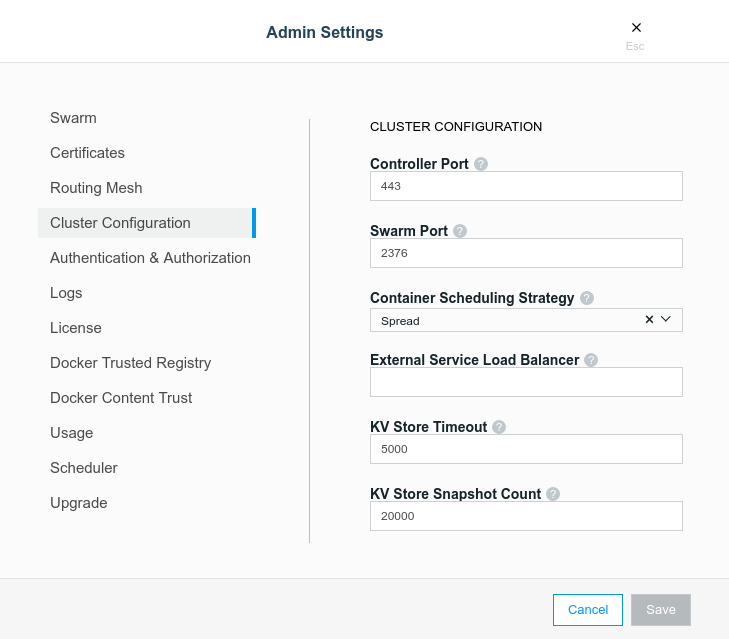

## Issue
By default, UCP listens on port `443`. This article explains how you can change the default UCP 2.2 controller port to your desired value through either the UCP Web UI or the command line.

## Prerequisites

Before performing these steps, you must meet the following requirements:
- Universal Control Plane 2.2.x
- Docker EE 17.06 and higher

## Resolution

### Via the UCP Web UI
Navigate to your UCP Web UI and follow these steps:
1. Click on your username on the top left corner.
2. Click on **Admin Settings**.
3. Click on **Cluster Configuration**.
4. Change the **Controller Port** value from `443` to your desired port number.
5. Click on **Save** for the change to take effect.

Do note that applying a change to this setting will result in UCP controllers restarting and may briefly interrupt UCP availability. If using a [load balancer for UCP](https://docs.docker.com/datacenter/ucp/2.2/guides/admin/configure/use-a-load-balancer/), the load balancer would also need to be reconfigured to accommodate this change.

### Via the Command Line (CLI)

In UCP version 2.2 and later, changing the controller port via CLI must be changed using the **UCP configuration file**. 

You may follow the steps in the documentation page [here](https://docs.docker.com/datacenter/ucp/2.2/guides/admin/configure/ucp-configuration-file/#inspect-and-modify-existing-configuration) to learn how to inspect and modify the existing configuration file.
 
When you edit the configuration file (`ucp-config.toml`), you should change the `controller_port` value to your desired port number. Please make this change before running the `docker config create` and `docker service update` commands. 

After a few seconds, you should notice that a new `ucp-agent` container is spun up and the `ucp-controller` container is restarted with the new port number. 

## Related Article

If you are on UCP 2.0, you may refer to the article [How do I change the UCP 2.0 controller port?](https://success.docker.com/article/How_do_I_change_the_UCP_Controller_Port).
