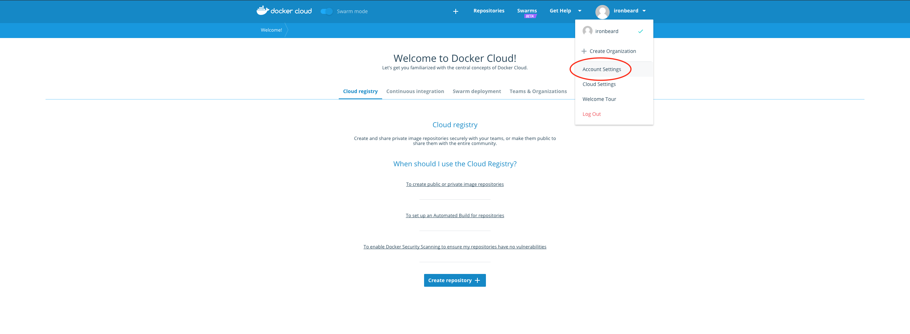
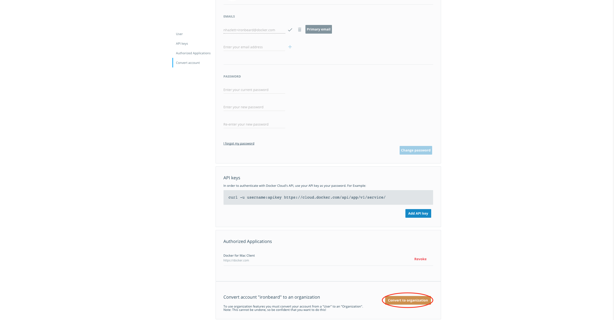
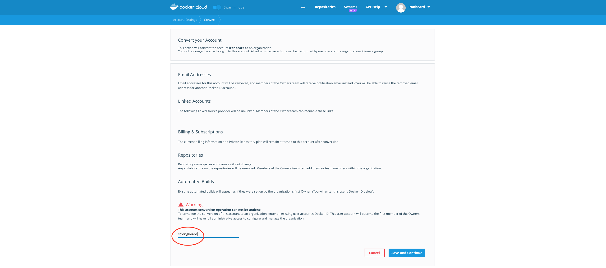
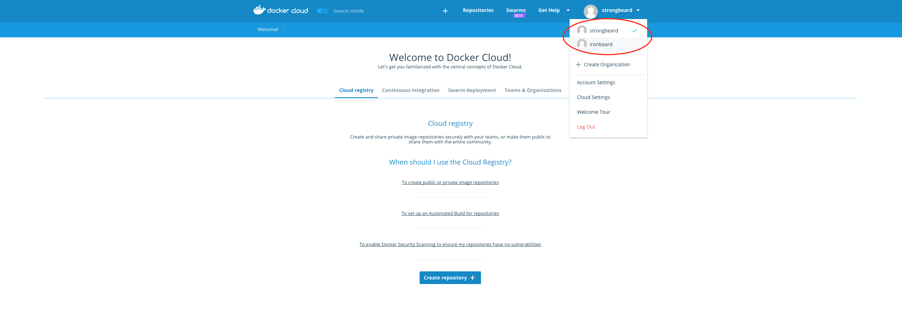
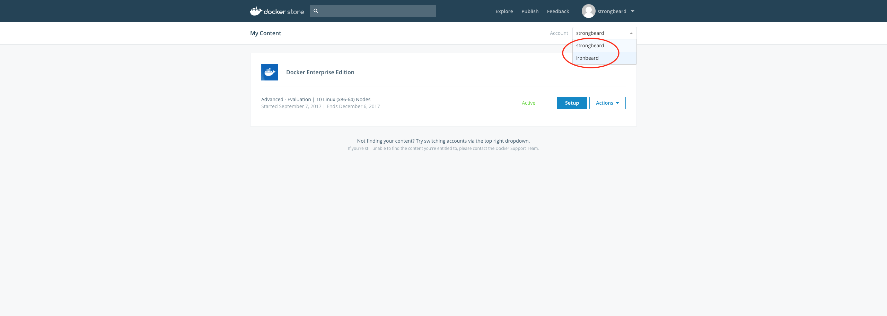
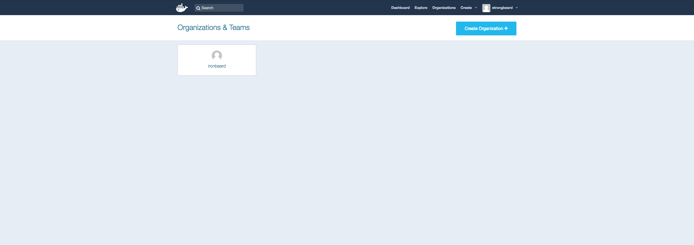

Yes, you can convert your Docker Hub/Cloud user account into an organization account.

**WARNING: Once the user account has been converted into an organization, this operation can not be undone or reverted to a user account.**

## Prerequisites

* The user account that you wish to convert must not be a member of any teams or organizations. If the user account belongs to any organizations, remove the account from all organizations. If the user account is the sole owner of any organization, either add someone to the "**owners**" team and then remove yourself from the organization, **or** delete the organization by opening a [Customer Service Request](https://success.docker.com/Support "Technical Support") using the email address associated with the account and provide the Docker ID of the organization you wish to delete.
* You need to have a separate Docker user account ready to assign it as the owner of the organization during conversion. In other words, if you wish to convert your user account into an organization account and you do not have any other user accounts, you need to create a new user account to assign it as the owner of the new organization. At the bottom of the conversion page, enter the Docker ID of the new owner of the organization. This user account then becomes the first member of the "**owners**" team and has full administrative access to configure and manage the organization. You may add more users into the "**owners**" team later.

## How It Works

Your user account will be converted into an organization account where all administrative duties are left to another user or group of users in the organization. Once the account conversion is done, you will be immediately logged out of the account and will no longer be able to log into this account. All administrative actions will be performed by the owners of the organizations (members of the "**owners**" group).

### Email Addresses

Email addresses for this account will be removed, freeing them up to be used for any other accounts. (You will be able to reuse the removed email address for another Docker user account.)

### Linked Accounts

Converting your account removes any associations to other services like GitHub or Atlassian Bitbucket. You will be able to link your external accounts to another Docker Hub user.

### Billing & Subscriptions

The current billing information and subscription plan will remain attached to this account after it has been converted into an organization account.

### Repositories

Repository namespaces and names will remain unchanged. Any user collaborators that you have configured for these repositories will be removed and can be reconfigured by the owners of the organization using teams.

### Automated Builds

Automated Builds for this account will be updated to appear as if they were originally configured by the initial organization owner. Any user in a group with 'admin' level access to a repository will be able to edit Automated Build Configurations.

## Steps to Convert The User Account into an Organization

The following provides a step-by-step explanation of how to convert a user account to an organization from the Docker Cloud UI.

1. Login to [Docker Cloud](https://cloud.docker.com/ "https://cloud.docker.com") with the user account you would like to convert to an organization.
2. Navigate to the **Account Settings** page: 
    
    
3. On the **Account Settings** page, scroll down to the convert account to an organization section and click **Convert to organization**: 
    
    
4. Ensure you have completed the all the [prerequisites](#Prerequisites "Can I convert my Docker Hub/Cloud user account into an organization account?") mentioned above.
5. Enter an existing [Docker ID](https://docs.docker.com/docker-id/ "https://docs.docker.com/docker-id/") in the box at the bottom of the **Convert your Account** page. This user account will become the first member of the Owners team and will have full administrative access to configure and manage the organization: 
    
    
6. Click on the **Save and Continue** button (you will be logged out immediately).
7. Your account has now been converted to an organization. To manage this organization you will be required to log into Docker Cloud with the existing Docker ID you entered in the previous step: 
    
    
8. Now when you are logged into Docker Cloud, you will notice your organization is also included in the top right drop down menu: 
    
    
9. Notice after the conversion process, the organization will also be available across [Docker Store](https://store.docker.com/ "https://store.docker.com") and [Docker Hub](https://hub.docker.com/ "https://hub.docker.com/"): 
    
    
    
    

## Common Errors

    User must first leave all organizations and groups.

This error refers to the [first prerequisite](#Prerequisites "Can I convert my Docker Hub/Cloud user account into an organization account?") explained above. Before you can convert a user account to an organization account, you must ensure that the user account you wish to convert is not a member of any organizations and teams.

    Cannot convert user to organization with that user as owner.

This error refers to the [second prerequisite](#Prerequisites "Can I convert my Docker Hub/Cloud user account into an organization account?") explained above. You would have to enter the Docker ID of an **existing** user to assign it as the owner of the organization. This Docker ID can not be the same as the account you are trying to convert.

    Please enter a valid Docker ID

This error is usually seen on Docker Cloud conversion page. It can refer to any of the [prerequisites](#Prerequisites "Can I convert my Docker Hub/Cloud user account into an organization account?") explained above.
