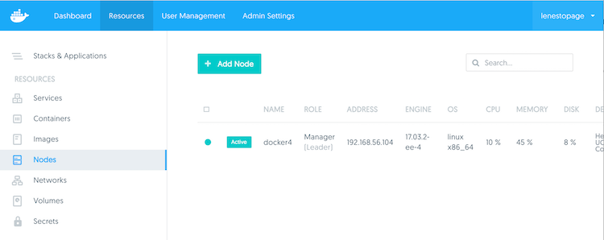
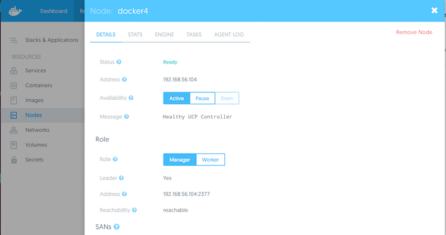

This is a brief guide to present how to properly start and stop the cluster for maintenance items such as server patching.

## Steps

To properly start and stop the Docker cluster for server maintenance, you will need to perform backups and perform the maintenance on each node, one node at a time. Perform the maintenance on all the worker nodes first, one at a time, and then move on to the manager nodes, one at a time.

Do so using the following steps:

1. Ensure you have backed up UCP and DTR, respective to the versions you have installed. Here are some docs to assist with the backups: [https://docs.docker.com/datacenter/u...ster-recovery/](https://docs.docker.com/datacenter/ucp/2.1/guides/admin/backups-and-disaster-recovery/ "https://docs.docker.com/datacenter/ucp/2.1/guides/admin/backups-and-disaster-recovery/") & [https://docs.docker.com/datacenter/d...ster-recovery/](https://docs.docker.com/datacenter/dtr/2.2/guides/admin/backups-and-disaster-recovery/ "https://docs.docker.com/datacenter/dtr/2.2/guides/admin/backups-and-disaster-recovery/").
2. After backups have been created, choose the "worker" node you plan on patching first.
3. You must first drain the node. Draining the node ensures that everything is stopped that is currently running on that node and rescheduled to other workers. In the UCP UI, go to **Resources** > **Nodes** and select the node. 
    
    
4. In the window that pops up, select **Availability** > **Drain**. 
    
    
5. Once the node is drained, you can proceed with the maintenance of the node. Bring the node back up and repeat for all the other worker nodes.
6. Once all of the "workers" are patched and brought online, repeat the same process with the managers.
7. Ensure that before you proceed to the next manager, the current manager being worked on is backed up and in a healthy state.
