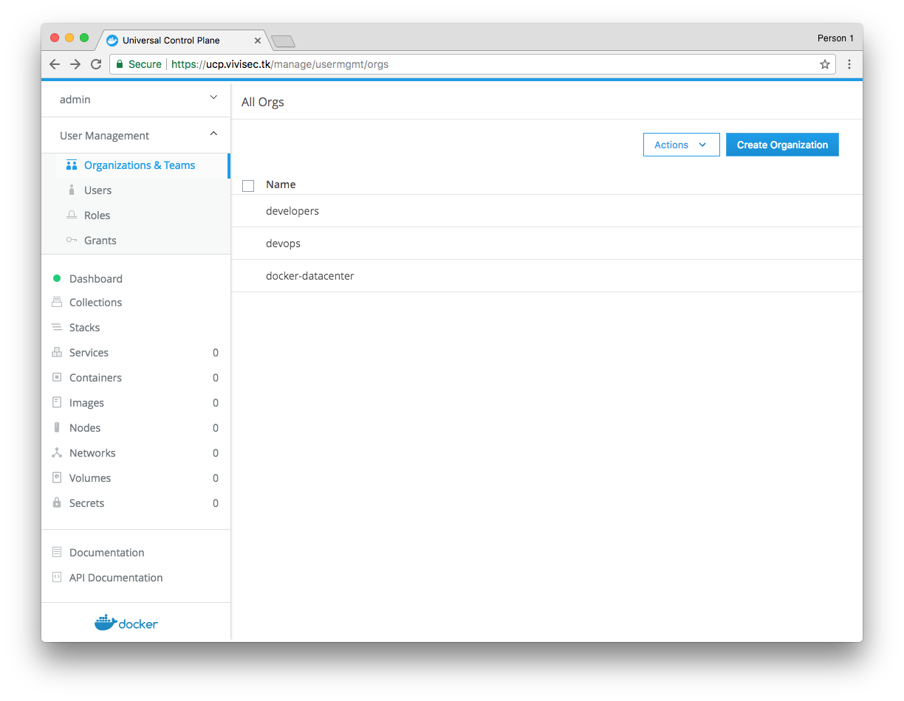
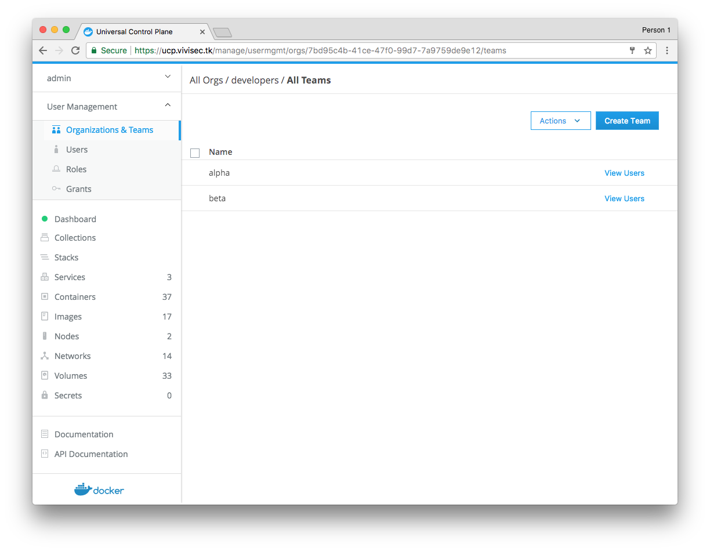
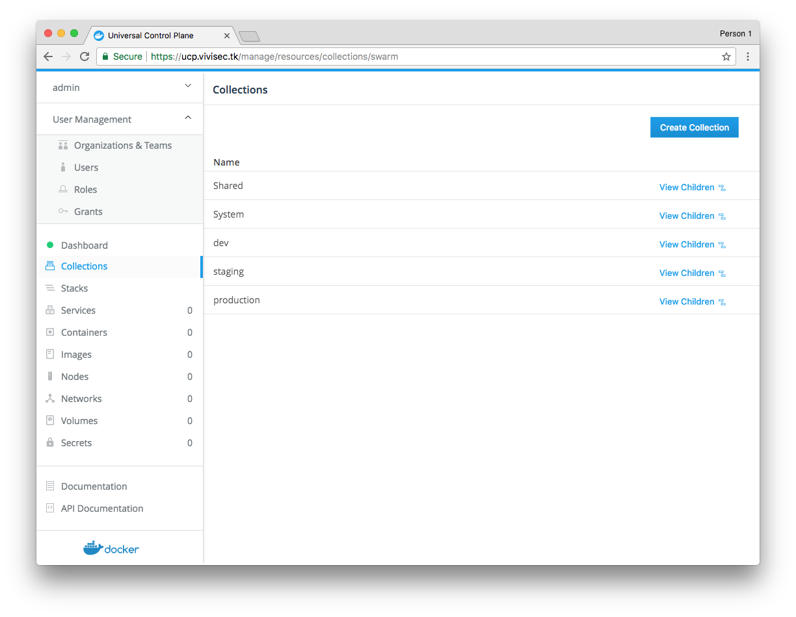
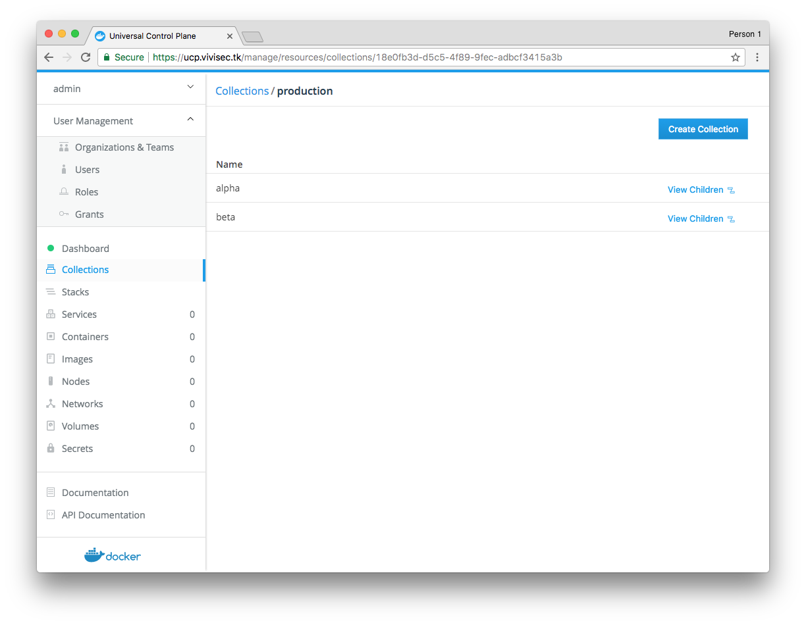

## Introduction

Role-Based Access Control (RBAC) in UCP is covered in the [Docker documentation](https://docs.docker.com/datacenter/ucp/2.2/guides/ "https://docs.docker.com/datacenter/ucp/2.1/guides/").

This guide expands on the concepts discussed in the documentation. It is an example of how a team of engineers might use this for their projects, and how each concept relates to their usecase.

> **Note:** As of UCP 2.2.0, the RBAC system has been significantly reworked with new features. This guide covers RBAC in Docker EE 17.06 and UCP 2.2. For Docker EE 17.03 and UCP 2.1, refer to [RBAC Example Use Case (Docker 17.03)](/article/RBAC_Example_Use_Case_17_03).

## Use Case

The use case discussed in this guide consists of two developer groups and one devops group. Individual member of this team might want to deploy various applications. There are two example "projects." One is called "project alpha," and the other is called "project beta." In production, "project beta" has some sensitive information that should not be accessed by the developers. Instead, only the head of the devops group should be allowed to access that environment.

## Users

Users for this team are as follows. Each person needs a UCP user account. By default, a user is only able to view, create, and modify resources that they own explicitly.

* billy
* alice
* chuck
* dave
* leonard
* earl
* frank
* gertrude

## Organizations and Teams

Users are then organized into teams across different organizations. There are two groups of developers. Leonard is in both groups.

There is one organization called "developers" that contains two teams: "alpha" and "beta". There is another organization called "devops".

Technically, there is only one group of people that fall into the "devops" category, so all devops people are in a single team. Since Gertrude is the only person authorized to handle containers that have sensitive data, she is in a different team in the devops organization called "sensitive".

* developers
    * alpha 
        * billy
        * alice
        * leonard
    * beta
        * chuck
        * dave
        * leonard
* devops 
    * members
        * earl
        * frank
        * gertrude
    * sensitive 
        * gertrude

Here is what the "developers" and "devops" organizations look like in the Organizations list in UCP:

Here is what the "alpha" and "beta" teams look like in the "developers" organization:

## Collections

Each deployed unit of services gets a collection that identifies it. Collections are hierarchical in nature. There is a dev, staging, and production deploy for each project: alpha and beta. There are any number of ways that this hierarchy could be created. How access is granted influences the best way to layout the collection hierarchy. In this case, there are dev, staging, and production in the root of the hierarchy: 

 * dev/alpha
 * dev/beta
 * staging/alpha
 * staging/beta
 * production/alpha
 * production/beta

It is possible to choose a different heirarchy to accomplish the same goal. For example, "alpha" could be the top level collection. The difference boils down to preference. For simplicity, this guide focuses on one approach.

> **Note:** Collections is a new concept in UCP 2.2.0. Previous versions of UCP used labels to identify/tag resources. Clusters that have been upgraded to UCP 2.2.0 or newer from 2.1.x or older will have each label be mapped to a collection of the same name under the `/Shared/legacy/<^><label><^^>` location.

#### Roles

As of UCP 2.2.x, roles can be defined with lots of granularity. Out-of-the-box, there exist a few default roles: None, View Only, Scheduler, Restricted Control, Full Control. Each role has its own set of permissions. The default roles should work for most use cases, and it should not be necessary in most environments to create more than a few custom roles. A role is specifically about listing permissions and should not reflect a team of people, nor a collection of resources. The role used in this example relates to the team/organization and to the collection in the next section.

The following table shows how each of these permissions map to each environment for each team. For example, the dev team for the alpha project has access to the alpha-dev environment and can do deploys. No one has "full control" permissions because no one needs access to the kernel, and no one needs to be able to run privileged containers. Members of the "devops (sensitive)" team are all members of the devops team, so it is only necessary to add the one permission difference that is needed. If a person is on multiple teams, the highest permission that is granted for a given collection is applied.

| Team \ Environment | dev/alpha          | staging/alpha      | production/alpha   | dev/beta           | staging/beta       | production/beta    |
|--------------------|--------------------|--------------------|--------------------|--------------------|--------------------|--------------------|
| developers alpha   | Restricted Control | View               | View               | -                  | -                  | -                  |
| develepers beta    | -                  | -                  | -                  | Restricted Control | View               | -                  |
| devops             | View               | Restricted Control | Restricted Control | View               | Restricted Control | View               |
| devops sensitive   | -                  | -                  | -                  | -                  | -                  | Restricted Control |

If anyone tries to change a resource that they have only "view" permissions to, they will get an "access denied" error message. If they don't have any permissions for a resource at all, the resource will not even show up. It will be like it does not exist.

Any time a user attempts to take an action, a collection must be specified explicitly, or the user's default collection will be used.

## Docker Compose Example

Specifying a collection in Compose is possible. Take the following example `docker-compose.yml` file as a starting point:

    version: '3.1'
    
    services:
      demodocker:
        image: nginx:alpine
        environment:
          - DOMAIN=test.ucp.local
        ports:
          - 80:80
          - 443:443
        volumes:
          - static_content:/var/www/html:ro
        deploy:
          mode: replicated
          replicas: 1
          resources:
            limits:
              memory: 1G
    
    volumes:
      static_content:

Using this file as-is with `docker-compose` or `docker stack deploy` means using whatever the default collection is for the user. To explicitly specify a collection inside Compose, the following changes need to be made:

    version: '3.1'
    
    services:
      demodocker:
        image: nginx:alpine
        environment:
          - DOMAIN=test.ucp.local
        ports:
          - 80:80
          - 443:443
        volumes:
          - static_content:/var/www/html:ro
        deploy:
          mode: replicated
          replicas: 1
          resources:
            limits:
              memory: 1G
          labels:
            - com.docker.ucp.access.label=/alpha/dev
    
    <^>networks:<^^>
      <^>frontend:<^^>
        <^>labels:<^^>
          <^>com.docker.ucp.access.label=/alpha/dev<^^>
    
    volumes:
      static_content:
        labels:
          com.docker.ucp.access.label=/alpha/dev

Note the addition of the `default` network entry. In a case where no network entry is defined, the `default` network is implicitly defined. To specify a collection for the default network, explicitly define this otherwise implicit resource and add the collection label.
