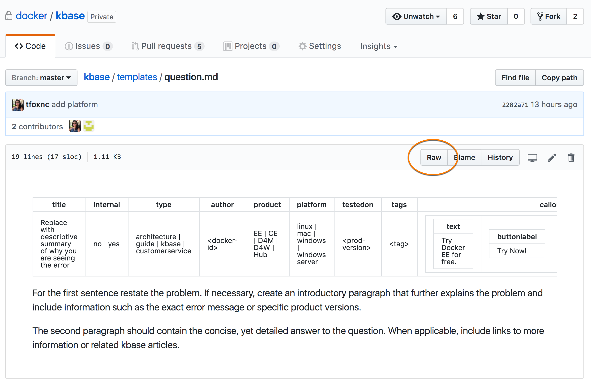
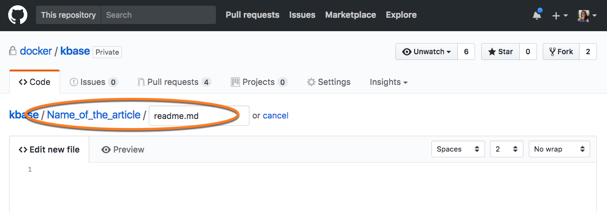
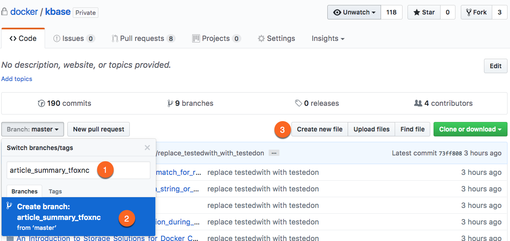
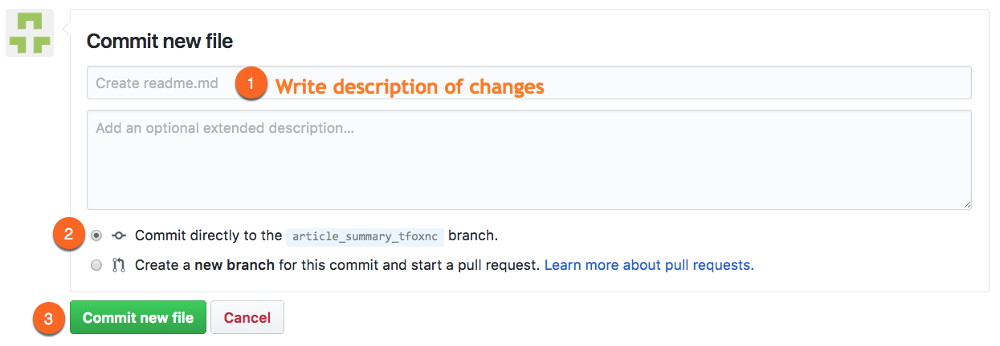
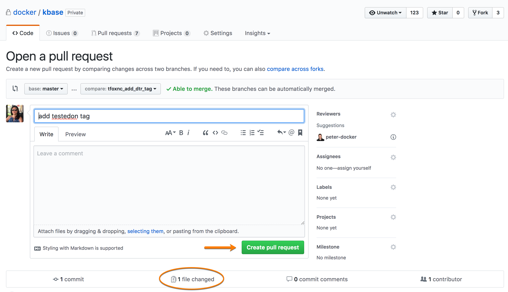
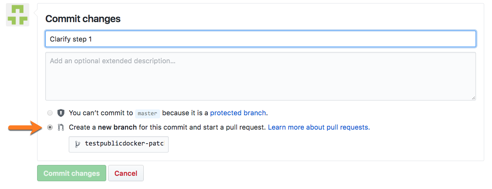
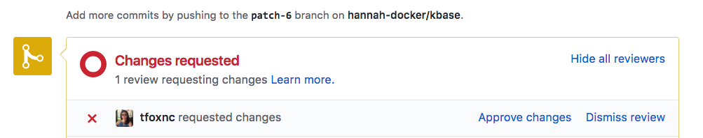

# Known Issue Handling
---

The following describes how to contribute to the Docker Knowledge Base using the Known Issue Handling process. First, it lists prerequisites and coding standards. Then, it gives step-by-step instructions for creating and updating articles.

Questions? Ping tfox on Slack or email.

## Prerequisites
1. Docker ID (must be logged into your Docker ID account to see the Edit button)
1. GitHub account
1. Access to the Docker internal GitHub repo

## Conventions

In the kbase repository:

* Each issue resides in its own subdirectory so any dependencies (such as images) remain in the same containing directory.
* The subdirectory name must be derived from the article's title (standard slug format).
    * Do not include punctuation.
    * Replace spaces with underscores (`_`).
* The content is contained in a `readme.md` file in the subdirectory.

For example:

```
docker/kbase/article_title_slug/
|-- images/
    |-- some_image.png
    |-- another_image.jpg
|-- readme.md
```

### Image Conventions

When articles are published from GitHub to the DSC, the images are copied from GitHub to the webserver. In the Markdown source file, images *must* use the following conventions:

* Images must be located inside an `images` directory inside the directory for the article. For example: `kbase/<article_title_slug>/images/some_image.png`
* Images must be specified in the Markdown file as a relative path:
    ```
    
    ```
    > **Note:** Do not use full paths to images in GitHub. While it might render properly in GitHub, all images for the DSC should live on the DSC site.
* All images should be no wider than **875px**.
* Avoid including too much white space around the image.
* Use `.png` or `.jpg` formats only.

## YAML Frontmatter Standards

Each kbase article is a `readme.md` file inside a directory named after the article title. The top of each `readme.md` file must include YAML frontmatter that defines title, author, tags, etc.

> **Note:** A title must exist in the YAML for the article to be successfully processed through the publication webhook.

The kbase [templates](templates/) include example YAML at the top of each template file along with an explanation of each.

### Tags

The kbase [standards](standards/) includes a complete list of valid tags, platforms, and products as well as the syntax for the testedon field. For your convenience, here are the list of acceptable tags:

- access control
- API
- backup
- daemon
- Docker Cloud
- Docker Content Trust
- Docker for Azure
- Docker for AWS
- error
- installing
- logging
- monitoring
- networking
- storage
- security
- upgrading
- uninstalling

## Markdown

The remainder of the kbase article file should be written in Markdown. If you are not familar with Markdown, here are a few good resources:

- [Basic writing and formatting syntax](https://help.github.com/articles/basic-writing-and-formatting-syntax/)
- [Markdown Cheatsheet](https://github.com/adam-p/markdown-here/wiki/Markdown-Cheatsheet)

### Custom Markdown

There is one set of custom markdown tags for replaceable text such as `example.com` or `your_node`. Use the following syntax for it:

```
<^>example.com<^^>
```

It will not render in the **Preview** tab for GitHub, but it will be shown in red on success.docker.com.

## Cloning the GitHub Repo via the CLI

If you only use the GitHub GUI, you can skip this step.

Before using the command line version of GitHub, you must first create a clone of the repo. 

**You only need to clone the repo once.** After creating the clone, you can update its contents to the latest version using the instructions in the next section *Fetching Repo Updates via the CLI*.

1. [Setup ssh keys](https://help.github.com/articles/connecting-to-github-with-ssh/).
1. From the command line, clone the kbase repo:
    ```
    git clone git@github.com:docker/kbase.git
    ```
    
> **Note:** This is a clone of the master branch. *It is not necessary to create a fork.* Using a clone of the master will allow others to view your in progress articles for collaboration.

This creates a local copy of the master branch on your system. By default, a directory named `kbase` is created, and all the files for the repo are in it using the previously mentioned directory structure.

## Fetching Repo Updates via the CLI

After creating the clone, it is important to update it *every time* before creating or updating articles. This ensures that you are working with the very latest versions of all the files in the repo.

1. Change into the directory that contains your local clone of the repo:
    ```
    cd kbase     
    ```
1. Verify that you are in the directory that contains your clone:
    ```
    git remote -v
    ```
1. You should see the repo as the origin and upstream repos:
    ```
    origin	https://github.com/docker/kbase.git (fetch)
    origin	https://github.com/docker/kbase.git (push)
    ```
1. Make sure you are in the master branch of the repo so you are fetching the lastest files:
    ```
    git checkout master
    ```
1. Fetch changes from upstream and merge them into your local clone:
    ```
    git pull
    ```
    
## Creating a New Article

GitHub allows new files to be created via the command line or via the [github.com](github.com) web interface. This section describes them both. Use whichever method works best for you.

### Via the Command Line

> **Note:** If you are using GitHub from the command line for the first time, read *Cloning the GitHub Repo via the CLI* earlier in this document.

1. Make sure you are in the master branch of the repo **before** creating a new article.
   ```
   git checkout master
   ```
1. Update your local copy with the lastest files using the steps in *Fetching Repo Updates via the CLI* earlier in this document.
   ```
   git pull
   ```
1. Change into the directory for the repo:
    ```
    cd kbase
    ```
1. Create an environment variable named `ISSUETITLE` equal to the slug for the article title (do not use spaces or punctuation in the slug).  This is used to create the GitHub directory name, so it **must be** the slug for the article title:
    ```
    ISSUETITLE=Replace_with_article_title
    ```
    > **Note:** Be sure to read the **Conventions** section above to learn how to format the directory name.
1. Create a branch for your new issue: 
    ```
    git checkout -b "$ISSUETITLE"
    ```
1. Create a directory for your new issue and change into it:
    ```
    mkdir "$ISSUETITLE"; cd "$ISSUETITLE"
    ```
1. Three templates exist (error, howto, and question). Copy the appropriate template file to a `readme.md` file in this directory to start your new issue: 
    ```
    cp ../templates/error.md ./readme.md
    ```
1. Fill out the template with details about the issue: 
    ```
    emacs readme.md
    ```
1. (Optional) If images are to be included, create an `images` directory:
    ```
    mkdir images
    ```
1. (Optional) Copy images for the article to this new directory. They must not be more than 875px wide.
1. Push your new issue to this repo: 
    ```
    git add readme.md; git commit -m "new issue"; git push -u origin "$ISSUETITLE"
    ```
    (or if you have images, each image must be added separately)
    ```
    git add readme.md; git add images/<image_name.png>; git add images/<image2_name.png>; git commit -m "new issue"; git push -u origin "$ISSUETITLE"
    ```        
1. When you are ready to have the article reviewed, create a pull request:
    1. Go to [https://github.com/docker/kbase/branches/yours](https://github.com/docker/kbase/branches/yours) to view your branches.
    1. Click the **New pull request** button for the `$ISSUETITLE` branch you just created.
    1. Keep the text of the pull request as is, and click the green **Create pull request** button.

### Via the GitHub Website (Submit new article immediately for review)

This process will allow you to create an article and immediately issue a pull request for it to be reviewed.

Use this process if you plan to write the entire article and submit it for review all at the same time.

To instead create a WIP article (draft that you can go back and edit before submitting it for review), see the next section *Via the GitHub Website (Create multiple drafts before submitting for review)*.

1. Go to the templates at [https://github.com/docker/kbase/tree/master/templates](https://github.com/docker/kbase/tree/master/templates) and decide which template to use.
1. Click on the name of the template file to view it.
1. Click on the **Raw** button in the top right corner to view the Markdown code for the file.
    
1. Copy the raw Markdown content into your clipboard.
1. Now go to the GitHub repo for the kbase: [https://github.com/docker/kbase](https://github.com/docker/kbase)
1. Click **Create new file** button in the top right corner.
1. In the text field, type the name of the new directory (the slug for the article title). **Do not use spaces or punctuation in the directory name.** 
    > **Note:** Be sure to read **Conventions** section above to learn how to use format the directory name.
1. After the directory name, type a forward slash (`/`). This forward slash tells GitHub that you just typed a directory name. 
1. Finally, add the filename `readme.md` to the end:
    
1. Paste the Markdown code of the template from your clipboard to the text area to start the article.
1. Write the article.
1. Create a pull request to have your issue reviewed:
    1. At the bottom of the page, under **Commit new file**, give a brief description of the change.
    1. Select **Create a new branch for this commit and start a pull request.** 
    1. A branch name will automatically be created. Use it or change it to a unique branch name.
    1. Click the green **Commit new file** button.
        

### Via the GitHub Website (Create multiple drafts before submitting for review)

To create a WIP article (draft that you can go back and edit before submitting it for review), use these steps. You can modify the file as many times as you want on the branch you will create *before* submitting a pull request.

1. Go to the templates at [https://github.com/docker/kbase/tree/master/templates](https://github.com/docker/kbase/tree/master/templates) and decide which template to use.
1. Click on the name of the template file to view it.
1. Click on the **Raw** button in the top right corner to view the Markdown code for the file.
    
1. Copy the raw Markdown content into your clipboard.
1. Now go to the GitHub repo for the kbase: [https://github.com/docker/kbase](https://github.com/docker/kbase)
1. Create a branch for your WIP article draft.
    1. Click on **Branch:master** pulldown menu, and type the name of the branch to be created. Use a summary of the article.
    1. Click on the blue button to create the branch.
    1. Click **Create new file** button to the right of the new branch name.
    
1. In the text field, type the name of the new directory (the slug for the article title). **Do not use spaces or punctuation in the directory name.** 
    > **Note:** Be sure to read **Conventions** section above to learn how to use format the directory name.
1. After the directory name, type a forward slash (`/`). This forward slash tells GitHub that you just typed a directory name. 
1. Finally, add the filename `readme.md` to the end:
    
1. Paste the Markdown code of the template from your clipboard to the text area to start the article.
1. Write the WIP article draft.
1. When you are reading to save the draft to come back to later, under **Commit new file**, give a description of the content added, select **Commit directly to <branch_name> branch** (default options), and click the green **Commit new file** button.
            
    
The WIP article draft will be on the branch you created and has *not* been submitted as a pull request yet for review.

To go back and edit the WIP article:

1. Go to [https://github.com/docker/kbase/branches/yours](https://github.com/docker/kbase/branches/yours) to view your branches.
1. Click on the branch name for the article you want to continue working on.
1. Browse into the directory for the article, and click on the `readme.md` file to start editing it again.
1. Commit directly to the branch again (do not create another branch).

To submit the finished article for review as a pull request:

1. Go to [https://github.com/docker/kbase/branches/yours](https://github.com/docker/kbase/branches/yours) to view your branches.
1. Click the **New pull request** button next to the name of the branch that contains the article to be reviewed.
1. Keep the text of the pull request as is, and click the green **Create pull request** button.
            

### What to Expect Next
1. Your pull request will automatically be assigned to the on duty reviewers.
1. The on duty reviewers will review your new issue and complete the required scorecard in the pull request (PR).
1. If the reviewers have questions or need clarification from you they will tag you in the PR. It's important that you respond in a timely manor.
1. The Content Manager (assignee) will make final edits if necessary and move to the `published` branch. If clarification is needed, you will be tagged in the PR.
1. Article will be published from the `published` branch via an automated script.

## Updating an Existing Article

GitHub allows files to be modified via the command line or via the [github.com](github.com) web interface. This section describes them both. Use whichever method works best for you.

### Via the Command Line

> **Note:** If you are using GitHub from the command line for the first time, read *Cloning the GitHub Repo via the CLI* earlier in this document.

1. Update your local copy with the lastest files using the steps in *Fetching Repo Updates via the CLI* eariler in this document.
1. Change into the directory for the repo:
    ```
    cd kbase
    ```
1. Decide on a title (one line summary) for your issue update and set it as a variable: 
    ```
    ISSUETITLE="<one line summary>"
    ```
1. Create a branch for your update using `$ISSUETITLE` as the name of the branch:
    ```
    git checkout -b "$ISSUETITLE"
    ```
1. Change to the directory for the issue you want to update (because this is an update, this directory already exists):
    ```
    cd `EXISTING_ISSUE_TITLE`
    ```
1. Make changes to the existing issue: 
    ```
    emacs readme.md
    ```
1. (Optional) If images are to be included, create an `images` directory if it doesn't already exist:
    ```
    mkdir images
    ```
1. (Optional) Copy images for the article to this new directory. They must not be more than 875px wide.    
    
1. Push your changes to this repo:
    ```
    git add readme.md; git commit -m "brief description of change"; git push -u origin "$ISSUETITLE"
    ```
    (or if you have images, each image must be added separately)
    ```
    git add readme.md; git add images/<image_name.png>; git add images/<image2_name.png>; git commit -m "new issue"; git push -u origin "$ISSUETITLE"
    ```    
1. Create a pull request to have your update reviewed:
    1. Go to [https://github.com/docker/kbase/branches/yours](https://github.com/docker/kbase/branches/yours) to view your branches.
    1. Click the **New pull request** button for the $ISSUETITLE branch you just created.
    1. Keep the text of the pull request as is, and click the green **Create pull request** button.
        

### Via the GitHub Website
1. Go to [success.docker.com](https://success.docker.com/).
1. Click the **Login** button in the top right corner.
1. Log in with your Docker ID.
1. Search for the article to be updated on [success.docker.com](https://success.docker.com/).
1. On the article page, click the **Edit** button in the top right corner.
1. On the GitHub page that opens, click the edit button (looks like a pencil) in the top right corner.
1. Make your changes.
1. Create a pull request to have your update reviewed:
    1. At the bottom of the page, under **Commit changes**, give a brief description of the change.
    1. Select **Create a new branch for this commit and start a pull request.**. A branch name will automatically be created.
        
    1. Click **Propose file change** button.

### What to Expect Next
1. The Content Manager (assignee) will make final edits if necessary and move to the `published` branch. 
1. If clarification is needed, you will be tagged in the PR.
1. Article will be published from the `published` branch via an automated script that runs every 24 hours. If you need it pushed sooner, contact the Content Manager (Tammy).

## Pull Request Review Process

After submitting a pull request for an article addition or change, the Content Manager will review the file changes. A technical review will also review depending on the topic.

After the pull request (pr) is reviewed, one of the following can happen:

- If there are no additional changes to be made, the Content Manager will accept the pr and publish the article either internally or externally, depending on the article.
- If the content requires changes, the author will receive an email as well as see the following message for the pull request:
    
    Make the necessary changes, commit them back to the same branch used by the pr so that the additional changes get automatically added to the pull request, and the Content Manager will review the additional changes.
    
This process will continue to happen until the article is accepted and published, either internally or externally.

## Branch Definitions

There are three sets of branches in the repository:

* `master` - All drafts and reviewed issues, published or not. Both internal and external.
* `published` - Reviewed, final articles. If not marked `internal`, they are also published on the Docker Success Center.
* Other branch names - Pending articles submitted via a pull request or WIP articles.
