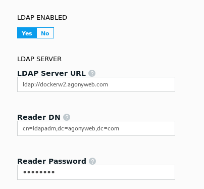

---
# Refer to https://github.com/docker/kbase/blob/master/standards/readme.md for detailed description of metadata
title: UCP LDAP authentication fails with wrong username and password
internal: no         # if not yes, then optional
comment: ""
type: kbase
author:  fotios.tsiadimos
product: 
  - EE
platform: 
  - linux
testedon: 
  - ucp-2.2.3
  - dtr-2.3.4
tags:
  - installing
  - upgrading
  - error
---
## Issue

Configuring UCP to authenticate against active directory fails with wrong username and password:

```
 level=error msg="error binding reader: LDAP Result Code 49 
```

## Resolution

The user in the  **Reader DN** section must use the full format of the username as shown:



