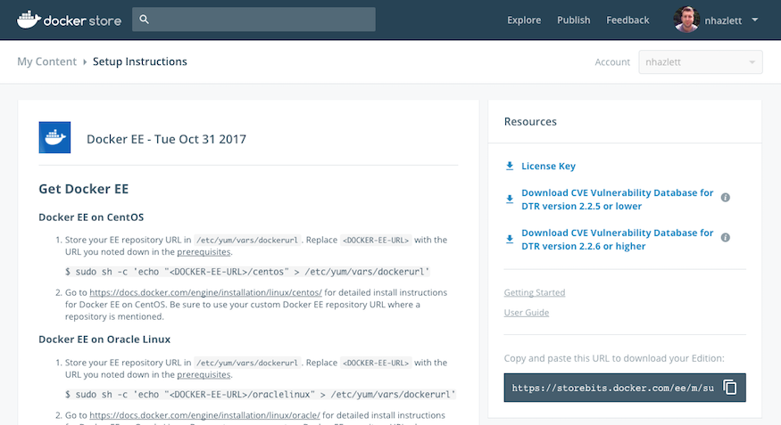

---
# Refer to https://github.com/docker/kbase/blob/master/standards/readme.md for detailed description of metadata
title: Where is my Docker Enterprise Edition license? 
internal: no             
comment: ""
type: kbase               
author: nhazlett 
product:       
  - ee         # EE (Docker EE - Basic, Standard, and Advanced)
  - Hub        # Docker Hub - and all related Store and Cloud functionality while those sites are being deprecated
testedon:           
platform:           
tags:               
---

You can download your Docker EE license by navigating to the [**My Content**](https://store.docker.com/my-content) page on [Docker Store](https://store.docker.com) and following these steps:

1. Log in with the Docker ID the subscription was associated with. If the subscription was associated with an organization, you will need to log in with a user account that is a member of the "Owners" team of that organization.

2. On the **My Content** page you will notice any active subscriptions that are associated with your Docker ID. If your subscription is associated with an organization, you will need to select the organization from the **Account** drop down menu in the top right corner of the **My Content** page. The **Account** dropdown menu includes any organizations of which your user account is a member of the "Owners" team.

3. Click the setup button on your subscription to be redirected to the setup instructions page where you can click the **License Key** link to download your EE license.

