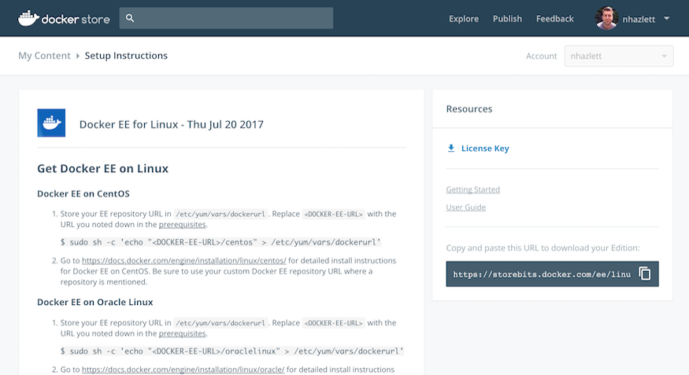

---
# Refer to https://github.com/docker/kbase/blob/master/standards/readme.md for detailed description of metadata
title: SKU reference for Docker EE subscriptions 
internal: yes 
comment: ""
type: kbase               
author: nhazlett 
product:       
  - ee         # EE (Docker EE - Basic, Standard, and Advanced)
  - Hub        # Docker Hub - and all related Store and Cloud functionality while those sites are being deprecated
testedon:           
platform:           
tags:               
---

## Issue

The following is an internal quick reference guide for our currently offered Enterprise Edition subscriptions. This should provide a brief explanation of what each subscription package includes. Also included are screenshots of how each subscription appears when accessed from the **My Content** page on the Docker Store.

## Docker EE Advanced

Support included with this package covers: 

- Enterprise Engine 
- UCP
- DTR
- Docker Security Scanning 

> **Notice in the following screenshot a link to download the license key, a link to download the CVE Vulnerability Database, and the Docker EE repository URL are all included with an EE Advanced Subscription. It's also worth mentioning that NFR Subscriptions are the same as EE Advanced Subscriptions and will appear the same:**

## Docker EE Standard 

Support included with this package covers:

- Enterprise Engine
- UCP
- DTR

> **Notice in the following screenshot only a link to download the license key and the Docker EE repository URL are included with an EE Standard subscription. Since DSS isn't included, the CVE Vulnerability Database download link isn't available:**

## Docker EE Basic

Support included with this package covers:

- Enterprise Engine "only"
 
> **Notice in the following screenshot only the Docker EE repository URL is included with an EE Basic Subscription. This is "EE Engine Only", therefore, a license key or CVE Vulnerability Database download link won't be available:**

